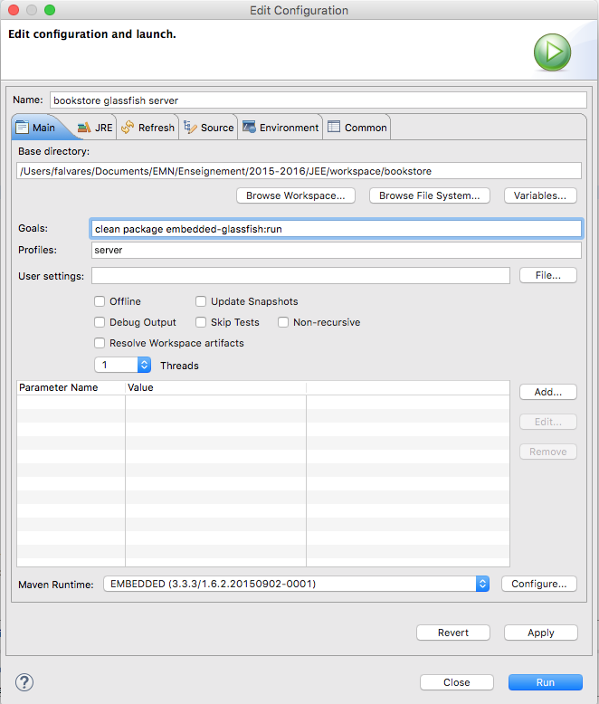

# Tutoriel 3 : Entrerprise Java Beans


## Mise en œuvre d'un couche de service sans état 

Nous allons mettre en œuvre une couche métier pour gérer les livres de notre
*bookstore*. Pour ce faire, nous allons nous appuyer sur un *Stateless Session Bean*,
c'est à dire un *Bean* de session qui ne garde pas l'état d'un client spécifique.  


### Service local

#### Interface

1. Créez un package `fr.emn.gsi2015.bookstore.business` pour stocker les classes *Beans* de la couche métier.
2. Créez une interface `BookLocalService` définissant les méthodes `List<Book> findBooks()`, `Book findBookById(Long id)` et `Book createBook(Book book)`. 
3. Nous voulons accéder à ces méthodes localement, donc précisez le avec l'annotation `@Local`. 

```java
package fr.emn.gsi2015.bookstore.business;

import java.util.List;

import javax.ejb.Local;

import fr.emn.gsi2015.bookstore.persistence.Book;

@Local
public interface BookLocalService {
        
   List<Book> findBooks();

   Book findBookById(Long id);
   
   Book createBook(Book book);
}

```

#### Session Bean

Maintenant nous pouvons procéder avec la mise en œuvre de notre *session bean*. 

1. Créez une classe *Bean* `BookEJB` dans le package `fr.emn.gsi2015.bookstore.business`. 
2. Nous n'avons pas besoin de garder l'étant d'un client spécifique. De ce fait, nous pouvons définir notre *bean* comme étant *Stateless* avec l'annotation `@Stateless`. 
3. Définissez une variable d'instance du type `EntityManager` permettant manipuler l'entité `Book` sur la base de données. Une astuce pour éviter la gestion manuelle d'ouverture et fermeture de connexion 
4. Implémentez les méthodes définies dans l'interface `BookLocalService`. 

Votre code devrait ressembler au code ci-dessous.

** Attention : ** afin de faciliter la gestion de dépendances, c-à-d la création, destruction d'objets dans un autre objet (ex. : l'objet du type `EntityManager` défini dans `BookEJB`) nous pouvons nous appuyer sur l'injection de dépendances. Il suffit d'utiliser une simple annotation (ex. : `@PersistenceContext(unitName = "bookstore-hsqldb")`) et le *framework* d'injection de dépendances s'occupe de tout (oui, c'est magique!).  


```java
public class BookEJB implements BookLocalService {

    @PersistenceContext(unitName = "bookstore-hsqldb")
    private EntityManager em;

    public List<Book> findBooks() {
         TypedQuery<Book> query = em.createNamedQuery("findAllBooks", Book.class);
         return query.getResultList();
    }
    
    
    public Book findBookById(Long id) {
         return em.find(Book.class, id);
    }

    public Book createBook(Book book) {
         em.persist(book);
         return book;
    }
}
```

#### Exécuter

Pour pouvoir utiliser le *Bean* de session `BookEJB` nous avons besoin de créer un conteneur EJB, le charger dans le conteneur. 

1. Créez une classe principal `MainLocal` dans le package `fr.emn.gsi2015.bookstore.business`.
2. Définissez des propriétés du conteneur permettant de charger les EJB à partir des `EJB.class` dans le répertoire `target/classes` de votre projet.   
 
   ```java
Map<String, Object> properties = new HashMap<>();
properties.put(EJBContainer.MODULES, new File("target/classes"));
   ```
3. Créez une instance du conteneur et récupérez son contexte. 

  ```java
  try (EJBContainer ec = EJBContainer.createEJBContainer(properties)) {
    Context ctx = ec.getContext();
    
    ...

  } catch (NamingException e) {
    e.printStackTrace();
  }
  ```

4. Cherchez le EJB via JNDI en suivant le standard `java:<scope>[/<app-name>]/<module-name>/<bean-name>[!<fully-qualified-interface-name>]`.

   ```java
BookLocalService bookEJB = (BookLocalService) ctx
     .lookup("java:global/classes/BookEJB!fr.emn.gsi2015.bookstore.business.BookLocalService");
   ``` 
5. Manipulez le *Bean* de session pour lister, ajouter et afficher les livres existants dans la base de données. 

Voici à quoi votre classe principal doit ressembler.

```java
package fr.emn.gsi2015.bookstore.business;


import java.io.File;
import java.util.HashMap;
import java.util.List;
import java.util.Map;

import javax.ejb.embeddable.EJBContainer;
import javax.naming.Context;
import javax.naming.NamingException;

import fr.emn.gsi2015.bookstore.persistence.Book;

public class MainLocal {
   public static void main(String[] args) {
       Map<String, Object> properties = new HashMap<>();
       properties.put(EJBContainer.MODULES, new File("target/classes"));

       try (EJBContainer ec = EJBContainer.createEJBContainer(properties)) {
           Context ctx = ec.getContext();

           // Loading session bean
           BookLocalService bookEJB = (BookLocalService) ctx
                           .lookup("java:global/classes/BookEJB!fr.emn.gsi2015.bookstore.business.BookLocalService");

           System.out.println("========== LISTING ALL AVAILABLE BOOKS ============");

           // Lists all books
           List<Book> books = bookEJB.findBooks();
           for (Book b : books) {
                   System.out.println(b);
           }

           System.out.println("========== CREATING A NEW BOOK : H2G2 ============");

           // Creates a new book and Persists the book to the database
           Book book = new Book("H2G2", "The Hitchhiker's Guide to the Galaxy", 12.5F, "1-84023-742-2", 354, false);
           bookEJB.createBook(book);

           System.out.println("========== RETRIEVING BOOK WHOSE ID IS 1001L ============");

           // Searches for a book whose id is 1001
           Book book2 = bookEJB.findBookById(1001L);
           System.out.println(book2);

           
           
           
           ctx.close();
           ec.close();
    
       } catch (NamingException e) {
               e.printStackTrace();
       }
   }
}
```

Pour exécuter cette classe, encore une fois, nous utilisons Maven pour compiler et exécuter notre classe principale. 

1. Ligne de commande : `mvn clean compile exec:java -Dexec.mainClass=fr.emn.gsi2015.bookstore.business.MainLocal` depuis la racine du projet.  
2. Sur Eclipse : 
  1. Clique droit sur le projet > Run As > Maven build... 
  2. Donnez un nom à cette configuration (ex. : bookstore compile and run - Business BookLocal)
  3. Précisez les *Goals* de Maven : `clean compile exec:java` 
  4. Cliquez sur *Add...* pour ajouter un paramètre. Ensuite entrez la valeur `fr.emn.gsi2015.business.MainLocal` pour le paramètre `exec.mainClass`. Ceci (dans ce cas notre classe principale) est utilisé par le plugin *exec-maven-plugin*.                
  5. Cliquez sur *Apply* et puis sur *Run*


La sortie devrait ressembler à ceci.

```
...
========== LISTING ALL AVAILABLE BOOKS ============
Book [id=1000, title=Beginning Java EE 6, price=49.0, description=Best Java EE book ever, isbn=1234-5678, nbOfPage=450, illustrations=true]
Book [id=1001, title=Beginning Java EE 7, price=53.0, description=No, this is the best , isbn=5678-9012, nbOfPage=550, illustrations=true]
Book [id=1010, title=The Lord of the Rings, price=23.0, description=One ring to rule them all, isbn=9012-3456, nbOfPage=222, illustrations=false]
========== CREATING A NEW BOOK : H2G2 ============
========== RETRIEVING BOOK WHOSE ID IS 1001L ============
Book [id=1001, title=Beginning Java EE 7, price=53.0, description=No, this is the best , isbn=5678-9012, nbOfPage=550, illustrations=true]
...

```

### Service distant (*Remote Service*)  

Parfois il est impérative de faire communiquer des objets qui logiquement (ou
même physiquement) distant, c'est à dire, des objets qui sont déployés sur
différents conteneurs (différents Java VM), différents serveurs, machines
physique, etc. 

Pour rendre accessible à distance un *Bean* session, il suffit de l'annoter avec `@Remote`. 


#### Interface

1. Créez une interface `BookRemoteService` dans le package `fr.emn.gsi2015.bookstore.business`
2. Définissez la méthode `List<Book> findBooksRemotely()`
3. Précisez, avec l'annotation `@Remote`, qu'il s'agit bien d'un service distant. 

```java
package fr.emn.gsi2015.bookstore.business;

import java.util.List;
import javax.ejb.Remote;
import fr.emn.gsi2015.bookstore.persistence.Book;

@Remote
public interface BookRemoteService  {        
   List<Book> findBooksRemotely();
}
```

#### Session Bean

Modifiez la classe `BookEJB` pour qu'elle implémente aussi l'interface `BookRemoteService`.

```java
@Stateless
public class BookEJB implements BookLocalService , BookRemoteService  {
        ...

    //accessed remotely via remote method interface
    public List<Book> findBooksRemotely() {
        return this.findBooks();
    }        
        
}
```

#### Entités *Serializable* 

Pour que les services soient accessible via le réseau, tous les classes entités (dans ce cas la classe `Book`) doivent implémenter l'interface `Serializable`. Ainsi, modifiez la classe `Book`, comme indiqué ci-dessous. 

```java
public class Book implements Serializable {
   ...
}

```

#### Serveur d'application

Cette fois ci nous allons utiliser le serveur d'application *Glassfish* pour
pouvoir accéder à notre EJB.  Pour cela, nous allons nous appuyer sur le plugin
Maven `maven-embedded-glassfish-plugin`. Il suffit de tapez `mvn clean package
embedded-glassfish:run`, depuis la racine du projet, pour packager notre projet, lancer le serveur
*Glassfish* tout en déployant le package généré contenant les classes entités
et EJBs.     

En ligne de commande : 

* Depuis la racine du projet, tapez : 
  ```
mvn -pserver clean package embedded-glassfish:run
  ```


Sur Eclipse, il faut procéder comme suit :

1. Clique droit sur le projet > Run As  > Maven Build...
2. Donnez un nom à votre configuration (ex. : bookstore glassfish server) 
3. Entrez les *Maven Goals* : `clean package embedded-glassfish:run`.
4. Entrez le *Profile* : `server`. Ceci est nécessaire pour indiquer la portée de la dépendance *Maven* (voir le [tutoriel 1](../environnement/)).
5. Appuyez sur `Apply` et ensuite `Run`.



Ça y est! Votre serveur projet sera packagé et déployé sur le serveur d'application *Glassfish*. 

```
...
Oct 22, 2015 6:12:50 PM com.sun.enterprise.web.WebApplication start
INFO: Loading application [bookstore-0.0.1-SNAPSHOT] at [/bookstore]
Oct 22, 2015 6:12:50 PM org.glassfish.deployment.admin.DeployCommand execute
INFO: bookstore-0.0.1-SNAPSHOT was successfully deployed in 11,552 milliseconds.
Oct 22, 2015 6:12:50 PM PluginUtil doDeploy
INFO: Deployed bookstore-0.0.1-SNAPSHOT
Hit ENTER to redeploy, X to exit
```

#### Client distant

Pour pouvoir utiliser le *Session Bean* distant nous allons tout d'abord
définir un client (une classe principale jouant le rôle d'un client).

1. Créez une classe principale `MainRemote` dans le package `fr.emn.gsi2015.bookstore.business`
2. Dans la méthode main créez un contexte initial avec des propriétés permettant l'accès à des EJB distants via JNDI. 
3. Récupérer le *Session Bean* `BookEJB` à partir de l'interface `BookRemoteService` via JNDI. 
4. Appelez la méthode `findBooksRemotely` et affichez le résultat. 

Voici à quoi doit ressembler la classe principale `MainRemote` : 

```java
package fr.emn.gsi2015.bookstore.business;

import java.util.Properties;
import javax.naming.InitialContext;
import javax.naming.NamingException;

public class MainRemote {

    public static void main(String[] args) {
       try {
           Properties props = new Properties();
           String host = "localhost";
           String port = "3700";
      
               props.setProperty("java.naming.factory.initial",
           "com.sun.enterprise.naming.SerialInitContextFactory");
           props.setProperty("java.naming.factory.url.pkgs",
                "com.sun.enterprise.naming");
           props.setProperty("java.naming.factory.state",
                "com.sun.corba.ee.impl.presentation.rmi.JNDIStateFactoryImpl");
           props.setProperty("org.omg.CORBA.ORBInitialHost", host);
           props.setProperty("org.omg.CORBA.ORBInitialPort", port);

           InitialContext ic = new InitialContext(props);
        
           System.out.println("=========== Looking for remote session bean =============");
           BookRemoteService bookEJB = (BookRemoteService) ic.lookup("fr.emn.gsi2015.bookstore.business.BookRemoteService");
           System.out.println("=========== Remote session bean found =============="); 
           System.out.println("=========== Retrieving books now! ============");
           System.out.println(bookEJB.findBooksRemotely());


       } catch (NamingException ex) {
           e.printStackTrace();
       }

    }

}
```

Pour exécuter le client, suivez les mêmes étapes pour exécuter la classe `MainLocal` en remplaçant  la classe `MainLocal` par `MainRemote`.

La sortie de votre programme doit ressemble à ça :

```
=========== Looking for remote session bean =============
=========== Remote session bean found ==============
=========== Retrieving books now! ============
[Book [id=1000, title=Beginning Java EE 6, price=49.0, description=Best Java EE book ever, isbn=1234-5678, nbOfPage=450, illustrations=true], Book [id=1001, title=Beginning Java EE 7, price=53.0, description=No, this is the best , isbn=5678-9012, nbOfPage=550, illustrations=true], Book [id=1010, title=The Lord of the Rings, price=23.0, description=One ring to rule them all, isbn=9012-3456, nbOfPage=222, illustrations=false]]
```


## Mise en œuvre d'un panier avec un *Stateful EJB* 

Nous allons mettre en œuvre un panier pour notre *bookstore* en ligne. Pour ce
faire, nous avons besoin d'un *bean* de session capable de garder l'état
spécifique à chaque client pendant toute la session. Nous pouvons implémenter ce 
comportement à l'aide des *stateful* EJBs. 


### Mise en œuvre de l'interface définissant le service

Créez une interface `ShoppingCartService` dans le package `fr.emn.gsi2015.bookstore.business` avec les méthodes : 
  1. `void addItem(Book item)` 
  2. `void removeItem(Book item)`
  3. `Integer getNumberOfItems()`
  4. `Float getTotal()`
  5. `void empty()`
  6. `void checkout()` 


### Définition du *session bean*

1. Créez une classe *Session Bean* `ShoppingCartEJB` dans le package `fr.emn.gsi2015.bookstore.business`. 
2. Comme nous avons besoin de garder l'état des cliente, nous devons définir notre *bean* comme étant *Stateful* avec l'annotation `@Stateful`. 
3. Enfin, à l'aide de l'annotation `@StatefulTimeout`, indiquez qu'au bout de 15 sans activité le *session bean* doit être détruit
3. Définissez une variable d'instance (c-a-d l'état du *session bean*) du type `List<Book>` pour stocker les livres du panier
4. Implémentez les méthodes définies dans l'interface `BookLocalService`
5. A l'aide de l'annotation `@Remove`, précisez que lors de l'exécution de la méthode `checkout` le *session bean* doit être détruit. 
 

Voici à quoi votre classe devrait ressembler : 

```java
package fr.emn.gsi2015.bookstore.business;

import java.util.ArrayList;
import java.util.List;
import java.util.concurrent.TimeUnit;

import javax.ejb.Remove;
import javax.ejb.Stateful;
import javax.ejb.StatefulTimeout;

import fr.emn.gsi2015.bookstore.persistence.Book;

@Stateful
@StatefulTimeout(value = 15, unit = TimeUnit.SECONDS)
public class ShoppingCartEJB implements ShoppingCartService {
        
        private List<Book> cartItems = new ArrayList<Book>();
        
        public void addItem(Book item) {
            if (!cartItems.contains(item))
                cartItems.add(item);
        }

        public void removeItem(Book item) {
            if (cartItems.contains(item))
                cartItems.remove(item);
        }

        public Integer getNumberOfItems() {
            if (cartItems == null || cartItems.isEmpty())
                return 0;
            return cartItems.size();
        }

        public Float getTotal() {
             if (cartItems == null || cartItems.isEmpty())
                return 0f;

             Float total = 0f;
             for (Book cartItem : cartItems) {
                 total += (cartItem.getPrice());
             }
             return total;
        }

        public void empty() {
            cartItems.clear();
        }

        @Remove
        public void checkout() {
            cartItems.clear();
        }        
}```

### Mise en œuvre d'un client local

Nous pouvons nous inspirer de la classe `MainLocal` pour mettre en œuvre un
client permettant tester le panier.


1. Créez une classe principal `MainShoppingCart` dans le package `fr.emn.gsi2015.bookstore.business`.
2. Définissez des propriétés du conteneur permettant de charger les EJB à partir des `*EJB.class` dans le répertoire `target/classes` de votre projet.   
3. Créez une instance du conteneur et récupérez son contexte. 
4. Cherchez les EJBs (`BookEJB` et `ShoppingCartEJB`) via JNDI 
5. Manipulez le *Session Bean* pour : 
  1. Récupérez un livre dans la base de données et l'ajouter au panier
  2. Exhibez le nombre de items et le total du panier
  3. Répétez les deux pas précédents avec un autre livre
  4. Faites le programme attendre 40s et vérifiez si le *session bean* `ShoppingCartEJB` est toujours accessible
  5. Si ce n'est pas le cas, cherchez une autre instance de  EJBs `ShoppingCartEJB` via JNDI 
  6. Exécuter la méthode `checkout` et vérifiez si le EJB est toujours accessible

Après avoir implémenté tous le points ci-dessus, voici à quoi le client devrait ressembler. 

```java
package fr.emn.gsi2015.bookstore.business;


import java.io.File;
import java.util.HashMap;
import java.util.Map;

import javax.ejb.embeddable.EJBContainer;
import javax.naming.Context;
import javax.naming.NamingException;

import fr.emn.gsi2015.bookstore.persistence.Book;

public class MainShoppingCart {
    public static void main(String[] args) {
        Map<String, Object> properties = new HashMap<>();
        properties.put(EJBContainer.MODULES, new File("target/classes"));

        try (EJBContainer ec = EJBContainer.createEJBContainer(properties)) {
            Context ctx = ec.getContext();

            // Loading session bean
            BookLocalService bookEJB = (BookLocalService) ctx
                            .lookup("java:global/classes/BookEJB!fr.emn.gsi2015.bookstore.business.BookLocalService");
            
            // Loading session bean
            ShoppingCartService shoppingCartEJB = (ShoppingCartService) ctx.lookup(
                            "java:global/classes/ShoppingCartEJB!fr.emn.gsi2015.bookstore.business.ShoppingCartService");
            
            System.out.println("========== RETRIEVING BOOK WHOSE ID IS 1001 ============");

            // Searches for a book whose id is 1001
            Book book = bookEJB.findBookById(1001L);
            System.out.println(book);

            
            System.out.println("========== ADDING BOOK TO SHOPPING CART ============");
            // Adds the book to the shopping cart
            shoppingCartEJB.addItem(book);
            
            System.out.println("Items : " + shoppingCartEJB.getNumberOfItems());
            System.out.println("Total price : " + shoppingCartEJB.getTotal());
            
            
            System.out.println("========== RETRIEVING BOOK WHOSE ID IS 1000 ============");

            // Searches for a book whose id is 1001
            book = bookEJB.findBookById(1000L);
            System.out.println(book);

            System.out.println("========== ADDING BOOK TO SHOPPING CART ============");
            // Adds the book to the shopping cart
            shoppingCartEJB.addItem(book);
            
            System.out.println("Items : " + shoppingCartEJB.getNumberOfItems());
            System.out.println("Total price : " + shoppingCartEJB.getTotal());
            
            
            System.out.println("========== SLEEPING FOR 40s ============");
    
            Thread.sleep(40000);
            try {
                    
                    System.out.println("Items : " + shoppingCartEJB.getNumberOfItems());
                    
            }
            catch (Exception e){
                    System.out.println("========== SESSION BEAN EXPIRED, GETTING ANOTHER ONE ============");
                    //session bean expired get another one
                    shoppingCartEJB = (ShoppingCartService) ctx.lookup(
                                    "java:global/classes/ShoppingCartEJB!fr.emn.gsi2015.bookstore.business.ShoppingCartService");
            }
            
            
            System.out.println("Items : " + shoppingCartEJB.getNumberOfItems());
            System.out.println("Total price : " + shoppingCartEJB.getTotal());
            
            System.out.println("========== CHECKING OUT ============");
            
            // Checks out the shopping cart
            shoppingCartEJB.checkout();
            
            System.out.println("Items : " + shoppingCartEJB.getNumberOfItems());
            
            ctx.close();
                ec.close();
        
        } catch (NamingException e) {
                e.printStackTrace();
        } catch (InterruptedException e) {
                // TODO Auto-generated catch block
                e.printStackTrace();
        }
    }
}

```

La sortie de l'exécution du client doit ressembler à l'extrait ci-dessous.
Attention aux exceptions dû à l'expiration / destruction des objets `ShoppingCartEJB`.  

```
========== RETRIEVING BOOK WHOSE ID IS 1001 ============
Book [id=1001, title=Beginning Java EE 7, price=53.0, description=No, this is the best , isbn=5678-9012, nbOfPage=550, illustrations=true]
========== ADDING BOOK TO SHOPPING CART ============
Items : 1
Total price : 53.0
========== RETRIEVING BOOK WHOSE ID IS 1000 ============
Book [id=1000, title=Beginning Java EE 6, price=49.0, description=Best Java EE book ever, isbn=1234-5678, nbOfPage=450, illustrations=true]
========== ADDING BOOK TO SHOPPING CART ============
Items : 2
Total price : 102.0
========== SLEEPING FOR 40s ============
Oct 22, 2015 11:15:51 PM com.sun.ejb.containers.util.cache.LruSessionCache getStateFromStore
SEVERE: [NRU-fr.emn.gsi2015.bookstore.business.ShoppingCartEJB]: Cannot load from  BACKUPSTORE FOR Key: <[90c00a00a81f-ffffffff9167ce09-0]>
Oct 22, 2015 11:15:51 PM com.sun.ejb.containers.BaseContainer postInvoke
WARNING: EJB5184:A system exception occurred during an invocation on EJB ShoppingCartEJB, method: public java.lang.Integer fr.emn.gsi2015.bookstore.business.ShoppingCartEJB.getNumberOfItems()
Oct 22, 2015 11:15:51 PM com.sun.ejb.containers.BaseContainer postInvoke
WARNING: 
javax.ejb.NoSuchObjectLocalException: The EJB does not exist. session-key: 90c00a00a81f-ffffffff9167ce09-0
        at com.sun.ejb.containers.StatefulSessionContainer._getContext(StatefulSessionContainer.java:1626)
        at com.sun.ejb.containers.BaseContainer.getContext(BaseContainer.java:2516)
        at com.sun.ejb.containers.BaseContainer.preInvoke(BaseContainer.java:1906)
        at com.sun.ejb.containers.EJBLocalObjectInvocationHandler.invoke(EJBLocalObjectInvocationHandler.java:210)
        at com.sun.ejb.containers.EJBLocalObjectInvocationHandlerDelegate.invoke(EJBLocalObjectInvocationHandlerDelegate.java:88)
        at com.sun.proxy.$Proxy215.getNumberOfItems(Unknown Source)
        at fr.emn.gsi2015.bookstore.business.MainShoppingCart.main(MainShoppingCart.java:64)

========== SESSION BEAN EXPIRED, GETTING ANOTHER ONE ============
Items : 0
Total price : 0.0
========== CHECKING OUT ============
Oct 22, 2015 11:15:51 PM com.sun.ejb.containers.util.cache.LruSessionCache getStateFromStore
SEVERE: [NRU-fr.emn.gsi2015.bookstore.business.ShoppingCartEJB]: Cannot load from  BACKUPSTORE FOR Key: <[90c00a00a81f-ffffffff9167ce09-1]>
Oct 22, 2015 11:15:51 PM com.sun.ejb.containers.BaseContainer postInvoke
WARNING: EJB5184:A system exception occurred during an invocation on EJB ShoppingCartEJB, method: public java.lang.Integer fr.emn.gsi2015.bookstore.business.ShoppingCartEJB.getNumberOfItems()
Oct 22, 2015 11:15:51 PM com.sun.ejb.containers.BaseContainer postInvoke
WARNING: 
javax.ejb.NoSuchObjectLocalException: The EJB does not exist. session-key: 90c00a00a81f-ffffffff9167ce09-1
        at com.sun.ejb.containers.StatefulSessionContainer._getContext(StatefulSessionContainer.java:1626)
        at com.sun.ejb.containers.BaseContainer.getContext(BaseContainer.java:2516)
        at com.sun.ejb.containers.BaseContainer.preInvoke(BaseContainer.java:1906)
        at com.sun.ejb.containers.EJBLocalObjectInvocationHandler.invoke(EJBLocalObjectInvocationHandler.java:210)
        at com.sun.ejb.containers.EJBLocalObjectInvocationHandlerDelegate.invoke(EJBLocalObjectInvocationHandlerDelegate.java:88)
        at com.sun.proxy.$Proxy215.getNumberOfItems(Unknown Source)
        at fr.emn.gsi2015.bookstore.business.MainShoppingCart.main(MainShoppingCart.java:83)
```

## *Bean* de session du type *Singleton* 

Les *beans* de session du type *Singleton*, ainsi comme ceux du type *Stateful*,
peuvent garder un état (une mémoire), mais un état partagé parmi tous les
clients. Cela veut dire qu'il n'y aura qu'une seule instance du EJB pour tous
les clients. 

Pour illustrer ce comportement, nous allons mettre en œuvre un EJB pour stocker
(en mémoire) les livres actuellement/récemment visualisés par tous les clients. 


### Interface de service

1. Créez une interface `LastViewsService` dans le package `fr.emn.gsi2015.bookstore.business`
2. Définissez les méthodes `List<Book> getLastViewed()` et `void addLastViewed(Book book)`
3. Précisez, à l'aide de l'annotation `@Remote`, qu'il s'agit bien d'un service distant. 
 

### *Bean* de session 


1. Créez une classe `LastViewsEJB` dans le package `fr.emn.gsi2015.bookstore.business` implémentant les méthodes définies dans `LastViewsService`
2. Indiquez, avec l'annotation `@Singleton`, qu'il s'agit d'une classe EJB singleton.


```java
@Singleton
public class LastViewsEJB implements LastViewsService {

    private List<Book> books = new LinkedList<Book>();
    
    public List<Book> getLastViewed() {
         return books;
    }
    
    public void addLastViewed(Book book) {
       if (!books.contains(book)){
           books.add(book);
           
           if (books.size() > 2){
                   books.remove(0);
           }
           
       }        
    }        
}
```

### Client distant

Nous pouvons nous inspirer du client `MainRemote` pour mettre en œuvre un client distant de `LastViewsEJB`. 
Le but est de lancer deux clients qui vont ajouter des libres à `LastViewsEJB` et d'afficher le contenu de la 
liste.

1. Créez une classe principale `MainLastViews` dans le package `fr.emn.gsi2015.bookstore.business`
2. Dans la méthode `main` créez un contexte initial avec des propriétés permettant l'accès à des EJB distants via JNDI. 
3. Récupérer les EJBs `BookEJB` et `LastViewsEJB` à partir des interfaces `BookRemoteService` et `LastViewsService` via JNDI. 
4. Récupérez les livres enregistrés dans la base de données (méthode `BookEJB.findBooksRemotely`) et affichez le résultat.
5. Choisissez au hasard un livre et ajoutez-le à la liste de livres récemment vus (méthode `LastViewsEJB.addLastViewed`). 
6. Récupérez la liste et affichez-la. Faites-le cinq fois en mettant une pause de 5s à chaque fois. Ceci permettra d'avoir le temps pour lancer d'autres clients. 

```java
package fr.emn.gsi2015.bookstore.business;

import java.util.List;
import java.util.Properties;

import javax.naming.InitialContext;
import javax.naming.NamingException;

import fr.emn.gsi2015.bookstore.persistence.Book;

public class MainLastViews {

   public static void main(String[] args) {
       try {
            Properties props = new Properties();
            String host = "localhost";
            String port = "3700";
     
            props.setProperty("java.naming.factory.initial",
                 "com.sun.enterprise.naming.SerialInitContextFactory");
            props.setProperty("java.naming.factory.url.pkgs",
                 "com.sun.enterprise.naming");
            props.setProperty("java.naming.factory.state",
                 "com.sun.corba.ee.impl.presentation.rmi.JNDIStateFactoryImpl");
            props.setProperty("org.omg.CORBA.ORBInitialHost", host);
            props.setProperty("org.omg.CORBA.ORBInitialPort", port);

            InitialContext ic = new InitialContext(props);
       
            System.out.println("=========== Looking for remote session bean =============");
            BookRemoteService bookEJB = 
              (BookRemoteService) ic.lookup("fr.emn.gsi2015.bookstore.business.BookRemoteService");
            LastViewsService lastViewsEJB = 
              (LastViewsService) ic.lookup("fr.emn.gsi2015.bookstore.business.LastViewsService");
            System.out.println("=========== Remote session bean found =============="); 
       
            System.out.println("=========== Retrieving books now! ============");
       
            List<Book> books = bookEJB.findBooksRemotely();
            System.out.println(books);
       
            int i = (int) ((Math.random()*10) % books.size());
       
            System.out.println("=========== Adding book to lastviews  ============");
            System.out.println(books.get(i));
       
            lastViewsEJB.addLastViewed(books.get(i));
       
       
            for (int j=0; j < 5; j++){
               System.out.println("=========== Retrieving last seen now! ============");
               for (Book b : lastViewsEJB.getLastViewed()){
                   System.out.println(b);
               }
               
               Thread.sleep(5000);
            }

      } catch (NamingException ex) {
      } catch (InterruptedException e) {
          e.printStackTrace();
      }
   }

}

```

### Exécution 

#### Serveur 

En ligne de commande:  

* Depuis la racine du projet, tapez : `mvn -pserver clean package embedded-glassfish:run`  

Sur Eclipse : 

* Nous pouvons lancer le serveur d'application avec Maven. Somme l'on avait déjà fait pour packager, déployer et lancez le serveur pour tester le `BookEJB` distant, nous pouvons ré-lancer la même configuration Maven.
  1. Clique droit sur le projet > Run As > Run Configurations. 
  2. Choisissez la configuration que vous avez crée (bookstore glassfish server)
  3. Appuyez sur `Run`. 


Une fois le serveur est lancé vous pouvez lancer le(s) clients


#### Client


En ligne de commande : 

* Depuis la racine du projet, tapez : 
  ```
mvn clean compile exec:java -Dexec.mainClass=fr.emn.gsi2015.bookstore.business.MainLastViews
  ```

Sur Eclipse : 

* Pareil que pour les autres exemples
  1. Clique droit sur le projet > Run As > Maven Build...
  2. Donnez un nom à votre configuration (ex. : `bookstore compile and run - Business MainLastViews`) pour pouvoir l'exécuter autres fois 
  3. Remplissez le champs *Goals* avec `clean compile exec:java`
  4. Ajoutez une proprieté (`exec.mainClass=fr.emn.gsi2015.bookstore.business.MainLastViews`) 
  5. Appoyez sur `Apply` et ensuite `Run`


** Pour voir l'effet *Singleton* du EJB, vous pouvez exécuter plusieurs clients. **

#### Sortie 

Sortie du premier client : 

```
=========== Looking for remote session bean =============
=========== Remote session bean found ==============
=========== Retrieving books now! ============
[Book [id=1000, title=Beginning Java EE 6, price=49.0, description=Best Java EE book ever, isbn=1234-5678, nbOfPage=450, illustrations=true], Book [id=1001, title=Beginning Java EE 7, price=53.0, description=No, this is the best , isbn=5678-9012, nbOfPage=550, illustrations=true], Book [id=1010, title=The Lord of the Rings, price=23.0, description=One ring to rule them all, isbn=9012-3456, nbOfPage=222, illustrations=false]]
=========== Adding book to lastviews  ============
Book [id=1001, title=Beginning Java EE 7, price=53.0, description=No, this is the best , isbn=5678-9012, nbOfPage=550, illustrations=true]
=========== Retrieving last seen now! ============
Book [id=1001, title=Beginning Java EE 7, price=53.0, description=No, this is the best , isbn=5678-9012, nbOfPage=550, illustrations=true]
=========== Retrieving last seen now! ============
Book [id=1001, title=Beginning Java EE 7, price=53.0, description=No, this is the best , isbn=5678-9012, nbOfPage=550, illustrations=true]
=========== Retrieving last seen now! ============
Book [id=1001, title=Beginning Java EE 7, price=53.0, description=No, this is the best , isbn=5678-9012, nbOfPage=550, illustrations=true]
Book [id=1010, title=The Lord of the Rings, price=23.0, description=One ring to rule them all, isbn=9012-3456, nbOfPage=222, illustrations=false]
=========== Retrieving last seen now! ============
Book [id=1001, title=Beginning Java EE 7, price=53.0, description=No, this is the best , isbn=5678-9012, nbOfPage=550, illustrations=true]
Book [id=1010, title=The Lord of the Rings, price=23.0, description=One ring to rule them all, isbn=9012-3456, nbOfPage=222, illustrations=false]
=========== Retrieving last seen now! ============
Book [id=1001, title=Beginning Java EE 7, price=53.0, description=No, this is the best , isbn=5678-9012, nbOfPage=550, illustrations=true]
Book [id=1010, title=The Lord of the Rings, price=23.0, description=One ring to rule them all, isbn=9012-3456, nbOfPage=222, illustrations=false]
``` 

Sortie du deuxième client :

```
=========== Looking for remote session bean =============
=========== Remote session bean found ==============
=========== Retrieving books now! ============
[Book [id=1000, title=Beginning Java EE 6, price=49.0, description=Best Java EE book ever, isbn=1234-5678, nbOfPage=450, illustrations=true], Book [id=1001, title=Beginning Java EE 7, price=53.0, description=No, this is the best , isbn=5678-9012, nbOfPage=550, illustrations=true], Book [id=1010, title=The Lord of the Rings, price=23.0, description=One ring to rule them all, isbn=9012-3456, nbOfPage=222, illustrations=false]]
=========== Adding book to lastviews  ============
Book [id=1010, title=The Lord of the Rings, price=23.0, description=One ring to rule them all, isbn=9012-3456, nbOfPage=222, illustrations=false]
=========== Retrieving last seen now! ============
Book [id=1001, title=Beginning Java EE 7, price=53.0, description=No, this is the best , isbn=5678-9012, nbOfPage=550, illustrations=true]
Book [id=1010, title=The Lord of the Rings, price=23.0, description=One ring to rule them all, isbn=9012-3456, nbOfPage=222, illustrations=false]
=========== Retrieving last seen now! ============
Book [id=1001, title=Beginning Java EE 7, price=53.0, description=No, this is the best , isbn=5678-9012, nbOfPage=550, illustrations=true]
Book [id=1010, title=The Lord of the Rings, price=23.0, description=One ring to rule them all, isbn=9012-3456, nbOfPage=222, illustrations=false]
=========== Retrieving last seen now! ============
Book [id=1001, title=Beginning Java EE 7, price=53.0, description=No, this is the best , isbn=5678-9012, nbOfPage=550, illustrations=true]
Book [id=1010, title=The Lord of the Rings, price=23.0, description=One ring to rule them all, isbn=9012-3456, nbOfPage=222, illustrations=false]
=========== Retrieving last seen now! ============
Book [id=1001, title=Beginning Java EE 7, price=53.0, description=No, this is the best , isbn=5678-9012, nbOfPage=550, illustrations=true]
Book [id=1010, title=The Lord of the Rings, price=23.0, description=One ring to rule them all, isbn=9012-3456, nbOfPage=222, illustrations=false]
=========== Retrieving last seen now! ============
Book [id=1001, title=Beginning Java EE 7, price=53.0, description=No, this is the best , isbn=5678-9012, nbOfPage=550, illustrations=true]
Book [id=1010, title=The Lord of the Rings, price=23.0, description=One ring to rule them all, isbn=9012-3456, nbOfPage=222, illustrations=false]
```
