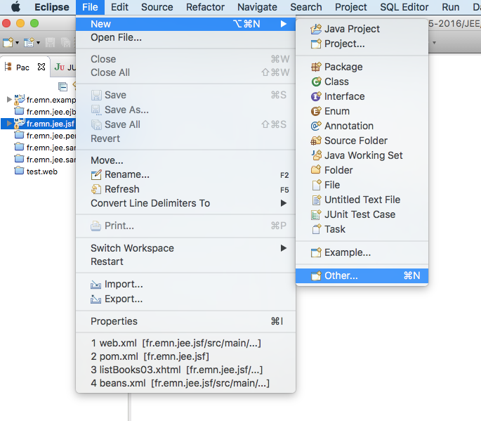
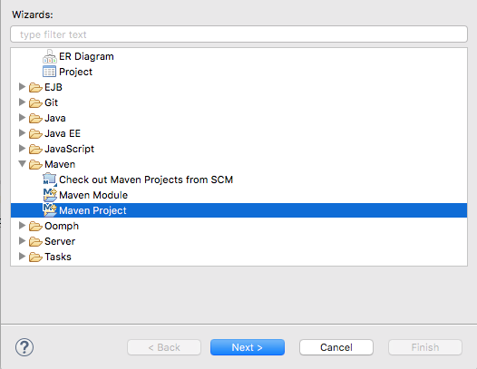
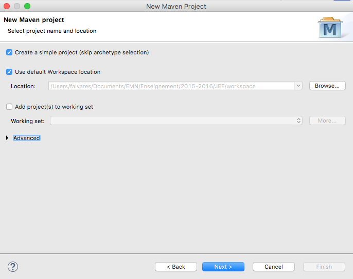
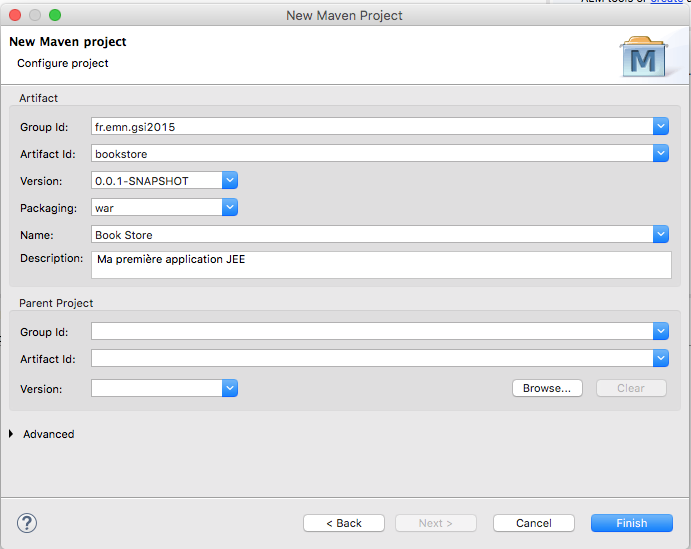
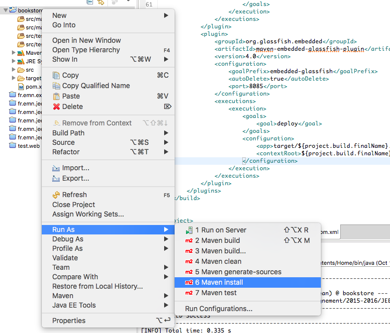

# Tutoriel 1 : Mise en place de l'environnement de développement

Ce tutoriel a pour but montre la démarche nécessaire pour mettre en place un environnement de travail permettant 
la compilation, test et exécution des applications JEE avec Eclipse et Maven.

**Attention : Maven est un outil très puissant mais assez compliqué à première
vue, n'essayez pas de tout comprendre. Le but ici n'est pas de maîtriser Maven,
mais de faciliter la gestion de dépendances, compilation et exécution de nos
applications.** 

## Outils à télécharger

Pour mettre en place l'environnement de travail, nous avons besoin de :

* [Java 7 ou 8 (JDK 1.7 ou 1.8)](http://www.oracle.com/technetwork/java/javase/downloads/jdk8-downloads-2133151.html) 
* Eclipse Mars.1 : comme environnement de développement graphique
  * [Windows 32bit](http://www.eclipse.org/downloads/download.php?file=/oomph/epp/mars/R1a/eclipse-inst-win32.exe)
  * [Windows 64bit](http://www.eclipse.org/downloads/download.php?file=/oomph/epp/mars/R1a/eclipse-inst-win64.exe)
  * [Mac OS X 64bit](http://www.eclipse.org/downloads/download.php?file=/oomph/epp/mars/R1a/eclipse-inst-mac64.tar.gz)
  * [Linux 32bit](http://www.eclipse.org/downloads/download.php?file=/oomph/epp/mars/R1a/eclipse-inst-linux32.tar.gz)
  * [Linux 64bit](http://www.eclipse.org/downloads/download.php?file=/oomph/epp/mars/R1a/eclipse-inst-linux64.tar.gz)
* Maven 3.x : pour pouvoir compiler et exécuter nos projets 
  * **Pas besoin de télécharger car c'est déjà intégré dans Eclipse**
* [HyperSQLDB 2.3](http://sourceforge.net/projects/hsqldb/files/hsqldb/hsqldb_2_3/) : comme système de gestion de base de données


## Création d'un projet Maven


1. Lancez Eclipse
2. Créez un nouveau projet Maven 
  1. File > New > Other 
  2. Maven > Maven Project, puis appuyez sur Next 
  3. Cochez l'option "Create a simple project..." et appuyez sur Next 
  4. Tapez les valeurs de champs comme montre la figure et appuyez sur Finish 
  5. Et voilà, vous venez de créer un projet Maven.  

## Configuration du projet

### Le fichier web.xml 

Vous avez du remarqué qu'il y a une erreur dans le projet. Cela est dû au fait que certains répertoires/fichiers requises pour la compilation d'un projet Web JEE ne sont pas présent. Nous devons donc ré-structurer le projet.

1. Créez un répertoire src/main/webapp/WEB-INF
2. Créez un fichier src/main/webapp/WEB-INF/web.xml contenant le code suivant

```xml
<web-app xmlns="http://xmlns.jcp.org/xml/ns/javaee"
         xmlns:xsi="http://www.w3.org/2001/XMLSchema-instance"
         xsi:schemaLocation="http://xmlns.jcp.org/xml/ns/javaee 
                             http://xmlns.jcp.org/xml/ns/javaee/web-app_3_1.xsd" 
         version="3.1">

</web-app>
```

Après ces changements, l'erreur précédent doit disparaître.


### Le fichier pom.xml

Maven a été conçu pour automatiser des tâches de développement telles que la compilation, packaging, installation, déploiement, etc., tout en prenant en compte les dépendances entre les projets. Toutes les configurations permettant décrire d'un projet Maven sont décrites dans le fichier pom.xml. 

Vous devez avoir une version à peu près comme ceci : 

```xml
<project xmlns="http://maven.apache.org/POM/4.0.0" 
         xmlns:xsi="http://www.w3.org/2001/XMLSchema-instance" 
         xsi:schemaLocation="http://maven.apache.org/POM/4.0.0 
                             http://maven.apache.org/xsd/maven-4.0.0.xsd">
  <modelVersion>4.0.0</modelVersion>
  <groupId>fr.emn.gsi2015</groupId>
  <artifactId>bookstore</artifactId>
  <version>0.0.1-SNAPSHOT</version>
  <packaging>war</packaging>
  <name>Bookstore</name>
  <description>ma première application JEE</description>
</project>
```

#### Dépendances 
   
Nous allons maintenant ajouter des références à d'autres projets (plugins)
Maven dont notre projet JEE dépendra pour pouvoir être compilé déployé ou même
exécuté. Pour ce faire, ajouter l'extrait ci-dessous au fichier pom.xml.  

```xml
<project>
...
<dependency>
   <groupId>org.glassfish.main.extras</groupId>
   <artifactId>glassfish-embedded-all</artifactId>
   <version>4.0</version>
   <scope>provided</scope>
</dependency>
<dependency>
   <groupId>org.eclipse.persistence</groupId>
   <artifactId>org.eclipse.persistence.jpa</artifactId>
   <version>2.5.0</version>
</dependency>
<dependency>
   <groupId>org.hsqldb</groupId>
   <artifactId>hsqldb</artifactId>
   <version>2.3.1</version>
</dependency>

</project>

```
<!--
<dependency>
   <groupId>junit</groupId>
   <artifactId>junit</artifactId>
   <version>4.11</version>
   <scope>test</scope>
</dependency>
-->

Le projet `glassfish-embedded-all` comprend Glassfish 4.0 (l'implementation de
référence de JEE) et toutes ses dépendances. Le projet `org.eclipse.persistence.jpa`
sera utile lors de l'utilisation de *Java Persistence API*. Quand au projet `hsqldb`, 
ceci contient le driver nécessaire pour accéder à une base de données HyperSQL DB.    

## Plugins pour la compilation et l'exécution 


Pour pouvoir compiler nôtre projet, nous pouvons nous appuyer sur un plug-in *maven-compiler-plugin*, 
comme indiqué ci-dessous entre les balises `<build> </build>`. 

```xml
<project ...>
...
<build>
   <plugins>
     <plugin>
        <groupId>org.apache.maven.plugins</groupId>
        <artifactId>maven-compiler-plugin</artifactId>
        <version>2.5.1</version>
        <configuration>
            <source>1.7</source>
            <target>1.7</target>
          <compilerArgument>-proc:none</compilerArgument>
        </configuration>
     </plugin>
     ...
   </plugins>
</build>
</project>
```

Nous pouvons également s'appuyer sur *exec-maven-plugin* pour exécuter un code Java. 

```xml
<build>
   <plugins>
     ...
     <plugin> 
        <groupId>org.codehaus.mojo</groupId> 
        <artifactId>exec-maven-plugin</artifactId> 
        <version>1.2.1</version> 
        <executions> 
            <execution> 
                 <goals> 
                     <goal>java</goal> 
                 </goals> 
            </execution> 
        </executions> 
     </plugin>
     ...     
</project>
```
<!--
Pour effectué des testes (unitaires, d'intégration, etc.), nous pouvons
utiliser le plug-in *maven-failsafe-plugin*.


```xml
<build>
   <plugins>
     ...
    <plugin>
         <groupId>org.apache.maven.plugins</groupId>
         <artifactId>maven-failsafe-plugin</artifactId>
         <version>2.12.4</version>
         <executions>
             <execution>
                <id>integration-test</id>
                 <goals>
                     <goal>integration-test</goal>
                     <goal>verify</goal>
                </goals>
             </execution>
         </executions>
      </plugin>
     ...
</project>
```
-->

Enfin, nous aurons aussi besoin de lancer un serveur web *embedded* (c-a-d dans
le même processus de la JVM) contenant tous les modules (pages de presentation
web, entities classes, EJBs, etc.). Pour ce faire, nous allons nous appuyer sur
le plug-in *maven-embedded-glassfish-plugin*. 

```xml
 <build>
   <plugins>
     ...
     <plugin>
         <groupId>org.glassfish.embedded</groupId>
         <artifactId>maven-embedded-glassfish-plugin</artifactId>
         <version>4.0</version>
         <configuration>
                <goalPrefix>embedded-glassfish</goalPrefix>
                <autoDelete>true</autoDelete>
                <port>8085</port>
         </configuration>
         <executions>
                <execution>
                   <goals>
                       <goal>deploy</goal>
                   </goals>
                   <configuration>
                     <app>target/${project.build.finalName}.war</app>
                     <contextRoot>${project.build.finalName}</contextRoot>
                   </configuration>
                </execution>
        </executions>
        </plugin>

      </plugins>
  </build>
</project>
```

## Télécharger les dépendances, compiler et packager le projet

A l'heure actuelle, nous n'avons aucun code à compiler, mais nous
pouvons quand même télécharger les dépendences en avance à fin d'éviter 
des saturations du réseau pendant les séances de cours/TD/TP. Pour ce faire 
il faut tout simplement exécuter la commande `mvn install` depuis la 
racine de nôtre projet. Sur Eclipse, il suffit de *cliquer droit* sur le projet, ensuite
 *Run As* > *Maven install*, comme illustré dans la figure ci-dessous.


 
Une fois la compilation, packaging et installation terminées, vous devrez avoir un message 
de compilation réussie.

```
...

[INFO] Building Bookstore 0.0.1-SNAPSHOT
[INFO] ------------------------------------------------------------------------
[INFO] 
[INFO] --- maven-clean-plugin:2.5:clean (default-clean) @ bookstore ---
[INFO] Deleting /Users/falvares/Documents/EMN/Enseignement/2015-2016/JEE/workspace/bookstore/target
[INFO] ------------------------------------------------------------------------
[INFO] BUILD SUCCESS
[INFO] ------------------------------------------------------------------------
[INFO] Total time: 0.335 s
[INFO] Finished at: 2015-10-19T22:02:27+02:00
[INFO] Final Memory: 8M/155M
[INFO] ------------------------------------------------------------------------
```
