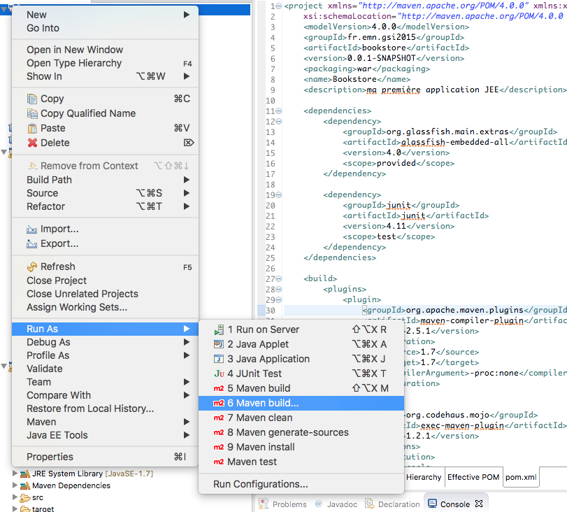
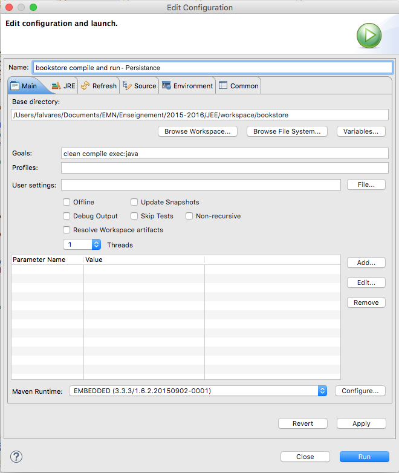
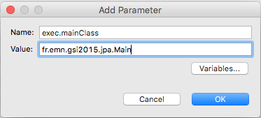

# Tutoriel 2 : *Java Persistence API*

Ce tutoriel a pour but d'aborder les aspects nécessaires pour la mise en œuvre de la couche
de données/persistance d'une application JEE. 

## Le SGBD

Nous allons utiliser HyperSQL DB comme SGBD. Si ce n'est pas encore fait, téléchargez le [ici](http://sourceforge.net/projects/hsqldb/files/hsqldb/hsqldb_2_3/).


### Lancement

Une fois téléchargé, décompressez le fichier .zip, lancez le Terminal et lancez HSQL DB en mode serveur, comme indiqué ci-dessous.

**Attention :** vous devez modifier le chemin `~/Desktop/hsqldb-2.2.3/hsqldb` par le chemin du répertoire dans lequel vous avez téléchargé et décompresser le fichier .zip.

```shell
$ cd ~/Desktop/hsqldb-2.2.3/hsqldb
$ java -cp lib/hsqldb.jar org.hsqldb.server.Server --database.0 file:mydb --dbname.0 bookStoreDB
```

La commande *java* ci-dessus lance HSQL DB en mode serveur et crée une base de
données appelée *bookStore* qui sera stocké dans le fichier *mydb* qui est
interne à HSQL.

Vous devrez avoir une sortie à peu près comme ceci :

```
[Server@372f7a8d]: [Thread[main,5,main]]: checkRunning(false) entered
[Server@372f7a8d]: [Thread[main,5,main]]: checkRunning(false) exited
[Server@372f7a8d]: Startup sequence initiated from main() method
[Server@372f7a8d]: Could not load properties from file
[Server@372f7a8d]: Using cli/default properties only
[Server@372f7a8d]: Initiating startup sequence...
[Server@372f7a8d]: Server socket opened successfully in 14 ms.
[Server@372f7a8d]: Database [index=0, id=0, db=file:mydb, alias=] opened sucessfully in 390 ms.
[Server@372f7a8d]: Startup sequence completed in 406 ms.
[Server@372f7a8d]: 2015-10-20 11:29:26.683 HSQLDB server 2.3.3 is online on port 9001
[Server@372f7a8d]: To close normally, connect and execute SHUTDOWN SQL
[Server@372f7a8d]: From command line, use [Ctrl]+[C] to abort abruptly
```

<!-- ### Création des tables

Nous avons bésoin de créer (au moins) une table pour stocker les informations des livres de notre *Bookstore*. Nous pouvons utiliser l'interface graphique *DBeaver* pour cet effet.  

1. Lancez *DBeaver* 
2. Créez une nouvelle connection
  1. File > New > Connection > HSQLDB > Server
  2. Entrez le nom de la base de donnée (*bookStore*) dans le champs *Database/schema*
  3. Entrez le username "SA" et laissez le password vide.
  4. Appuiez sur *Next* deux fois, puis appyez sur *Finish*.  
3. Connectez à votre Base de donnée *bookStore*
4. Créez la table `Book`
  1. SQL Editor > New SQL Editor
  2. Exécutez la commande pour créer la table
  ```sql
  CREATE TABLE Book (
        id INT,
        title VARCHAR(100),
        price NUMERIC,
        description VARCHAR(2000),
        isbn CHAR(13),
        nbOfPage INT,
        illustrations BOOLEAN,
        PRIMARY KEY (id)
  );
  ```
  3. Insérez quelques livres dans la base de données
  ```sql
   INSERT INTO BOOK(ID, TITLE, DESCRIPTION, ILLUSTRATIONS, ISBN, NBOFPAGE, PRICE) 
             VALUES(1000, 'Beginning Java EE 6', 'Best Java EE book ever', 1, '1234-5678', 450, 49);
   INSERT INTO BOOK(ID, TITLE, DESCRIPTION, ILLUSTRATIONS, ISBN, NBOFPAGE, PRICE) 
             VALUES(1001, 'Beginning Java EE 7', 'No, this is the best ', 1, '5678-9012', 550, 53);
   INSERT INTO BOOK(ID, TITLE, DESCRIPTION, ILLUSTRATIONS, ISBN, NBOFPAGE, PRICE)
             VALUES(1010, 'The Lord of the Rings', 'One ring to rule them all', 0, '9012-3456', 222, 23);
  ```
-->


## Entités 

Nous voulons établir un lien entre les classes/objets Java (*JavaBean*) et
les tables correspondants de la base de données. 

### Création d'un JavaBean représentant un Livre

1. Créez un package `fr.emn.gsi2015.bookstore.persistence` dans le répertoire `src/main/java` de votre projet. 
2. Créez la classe `Book` ayant les attributs :
  * id (Long)
  * title (String)
  * price (Float)
  * description (String)
  * isbn (String)
  * nbOfPage (Integer)
  * nbOfPage (Integer)
  * illustrations (Boolean)
3. Implémentez un constructeur vide et un autre prennant en entrée tous la valeur de tous les attributs 
4. Implémentez des méthodes *getters* et *setters* pour chaqu'un des attributs
5. Implémentez une méthode *toString*


### Meta-données et Annotations 

Nous nous appoyons sur des meta-données sous forme d'annotations afin de lier
les objets de notre application (e.g., des objets de la classe *Book*) à notre
base de données. Nous pourrions également utiliser des fichiers externes *.xml*
au lieu des annotations.   

L'annotation `@Entity` permet de préciser que la classe *Book* correspond à une
entité (de même nom) de la base de données. `@Entity(name="Livre")` permet de
préciser le nom de cet entité s'il est différent du nom de la classe en
question.

#### Entités 

```java
@Entity
public class Book {
...
}

```
#### Attributs

Quand à l'annotation `@Id` elle sert à préciser qu'un attribut correspond à un
identifiant unique (e.g., clé primaire). `@GeneratedValue` précise que cette
valeur est généré automatiquement par le SGBD. Nous pourrions aussi utiliser
l'annotation `@Column` pour préciser le nom d'un attribut ou pour préciser de
contraintes liées à la base de données. 


```java
@Entity
public class Book {
  @Id
  @GeneratedValue(strategy=GenerationType.IDENTITY)
  private Long id;
  @Column(name="titre",nullable = false)
  private String title;
  @Column(length = 2000 )
  private String description
}

```


#### Requêtes nommées 

Nous pouvons définir un ensemble de requêtes nommées pouvant être appelées par leur nom.

```java
@Entity
@NamedQueries({ @NamedQuery(name = "findAllBooks", query = "SELECT b FROM Book b"),
                @NamedQuery(name = "findBookH2G2", query = "SELECT b FROM Book b WHERE b.title ='H2G2'") })
public class Book {
...
}
```


#### Version minimaliste 

Enfin, le code annoté ci-dessous fait le mapping entre le JavaBean `Book` et l'entité de la base de données de 
même nom dont l'attribut *id* est la clé primaire et ceci est générée automatiquement par le SGBD.


```java
@Entity
@NamedQueries({ @NamedQuery(name = "findAllBooks", query = "SELECT b FROM Book b"),
                @NamedQuery(name = "findBookH2G2", query = "SELECT b FROM Book b 
                                                                    WHERE b.title ='H2G2'") })
public class Book {

        @Id
        @GeneratedValue(strategy=GenerationType.IDENTITY)
        private Long id;
        private String title;
        private Float price;
        private String description;
        private String isbn;
        private Integer nbOfPage;
        private Boolean illustrations;
        
        public Book() {
        }

        public Book(String title, String description,  Float price, String isbn, 
                Integer nbOfPage, Boolean illustrations) {
                this.title = title;
                this.price = price;
                this.description = description;
                this.isbn = isbn;
                this.nbOfPage = nbOfPage;
                this.illustrations = illustrations;
        }
        
        public Long getId() {
                return id;
        }
        public void setId(Long id) {
                this.id = id;
        }
        public String getTitle() {
                return title;
        }
        public void setTitle(String title) {
                this.title = title;
        }
        public Float getPrice() {
                return price;
        }
        public void setPrice(Float price) {
                this.price = price;
        }
        public String getDescription() {
                return description;
        }
        public void setDescription(String description) {
                this.description = description;
        }
        public String getIsbn() {
                return isbn;
        }
        public void setIsbn(String isbn) {
                this.isbn = isbn;
        }
        public Integer getNbOfPage() {
                return nbOfPage;
        }
        public void setNbOfPage(Integer nbOfPage) {
                this.nbOfPage = nbOfPage;
        }
        public Boolean getIllustrations() {
                return illustrations;
        }
        public void setIllustrations(Boolean illustrations) {
                this.illustrations = illustrations;
        }

        @Override
        public String toString() {
                return "Book [id=" + id + ", title=" + title + 
                              ",price=" + price + ", description=" + description + 
                              ", isbn="        + isbn + ", nbOfPage=" + nbOfPage + 
                              ", illustrations=" + illustrations + "]";
        }
        
}
``` 


## Données initiales

Parfois, nous avons besoin de charger la base de donnée afin de pouvoir la tester. Pour ce faire, créez 
un fichier `insert.sql` dans `src/main/resources` contenant le script SQL ci-dessous.

```sql
INSERT INTO BOOK(ID, TITLE, DESCRIPTION, ILLUSTRATIONS, ISBN, NBOFPAGE, PRICE) VALUES(1000, 'Beginning Java EE 6', 'Best Java EE book ever', 1, '1234-5678', 450, 49);
INSERT INTO BOOK(ID, TITLE, DESCRIPTION, ILLUSTRATIONS, ISBN, NBOFPAGE, PRICE) VALUES(1001, 'Beginning Java EE 7', 'No, this is the best ', 1, '5678-9012', 550, 53);
INSERT INTO BOOK(ID, TITLE, DESCRIPTION, ILLUSTRATIONS, ISBN, NBOFPAGE, PRICE) VALUES(1010, 'The Lord of the Rings', 'One ring to rule them all', 0, '9012-3456', 222, 23);
  ```


## Unités de persistance / configuration JPA


1. Créez un sous-répertoire `META-INF` dans `src/main/resources`. Ce répertoire hébergera les méta-données sous forme de fichier XML.
2. Créez un fichier `persistence.xml` contenant au moins une *persistence-unit*.
 
```xml
<?xml version="1.0" encoding="UTF-8"?>
<persistence xmlns="http://xmlns.jcp.org/xml/ns/persistence"
        xmlns:xsi="http://www.w3.org/2001/XMLSchema-instance"
        xsi:schemaLocation="http://xmlns.jcp.org/xml/ns/persistence
                            http://xmlns.jcp.org/xml/ns/persistence/persistence_2_1.xsd" version="2.1">
        
   <persistence-unit name="bookstore-hsqldb">
      <provider>org.eclipse.persistence.jpa.PersistenceProvider</provider>
      <class>fr.emn.gsi2015.bookstore.persistence.Book</class>
      <properties>
         <property name="javax.persistence.schema-generation.database.action" value="drop-and-create" />
         <property name="javax.persistence.jdbc.driver" value="org.hsqldb.jdbcDriver" />
         <property name="javax.persistence.jdbc.url" value="jdbc:hsqldb:hsql://localhost/bookStoreDB;shutdown=true" />
         <property name="javax.persistence.jdbc.user" value="SA" />
         <property name="javax.persistence.jdbc.password" value="" />
         <property name="javax.persistence.sql-load-script-source" value="insert.sql" />
      </properties>
   </persistence-unit>        
</persistence>
```

Comme vous avez pu remarqué, la *persistence-unit* contient des informations
pour accéder à notre base de données *bookStoreDB* sur HSQLDB. Il faut
souligner que la propriété
`javax.persistence.schema-generation.database.action=drop-and-create`
précise que le schéma de la base de données sera supprimé et créée au début de
l'exécution de l'application en question. Quand à `javax.persistence.sql-load-script-source=insert.sql`, cette
propriété permet d'exécuter un script pour charger la base de données. 

## Gestionnaire d'entités

Pour pouvoir manipuler les entités (créer, mettre à jour, supprimer, consulter)
dans la base de données avec JPA, il suffit d'utiliser le gestionnaire d'entités 
(`EntityManager`). A partir de la fabrique `EntityManagerFactory` nous avons accès 
à un gestionnaire d'entités.   

```java
EntityManagerFactory emf = Persistence.createEntityManagerFactory("bookstore-hsqldb");
EntityManager em = emf.createEntityManager();
```

### Exemples

#### Lister toutes les entrées de la rélation *Book*

```java
List<Book> books = em.createNamedQuery("findAllBooks", Book.class).getResultList(); 
```

#### Créer un nouveau *Book* 

```java
Book book = new Book("H2G2", "The Hitchhiker's Guide to the Galaxy", 12.5F,
                        "1-84023-742-2", 354, false); 
EntityTransaction tx = em.getTransaction();
tx.begin();
em.persist(book);
tx.commit();
```

#### Consulter 
```java
Book book2 = em.find(Book.class, 1001L);
```

#### Mettre à jour
```java
EntityTransaction tx = em.getTransaction();
tx.begin();
book2.setPrice(13.4F); 
tx.commit();
```

#### Supprimer
```java
EntityTransaction tx = em.getTransaction();
tx.begin();
em.remove(book2);
tx.commit();
```

#### Classe principale

Nous allons créer une classe principale permettant l'exécution de quelques exemples ci-dessus. 


```java
package fr.emn.gsi2015.bookstore.persistence;

import java.util.List;

import javax.persistence.EntityManager;
import javax.persistence.EntityManagerFactory;
import javax.persistence.EntityTransaction;
import javax.persistence.Persistence;

public class Main {
  public static void main(String[] args) {
     // Obtains an entity manager
     EntityManagerFactory emf = Persistence.createEntityManagerFactory("bookstore-hsqldb");
     EntityManager em = emf.createEntityManager();
            
     System.out.println("========== LISTING ALL AVAILABLE BOOKS ============");
             
     // Lists all books
     List<Book> books = em.createNamedQuery("findAllBooks", Book.class).getResultList();
     for (Book b : books) {
             System.out.println(b);
     }
            
     System.out.println("========== CREATING A NEW BOOK : H2G2 ============");
      
     // Creates a new book and Persists the book to the database
     Book book = new Book("H2G2", "The Hitchhiker's Guide to the Galaxy", 12.5F, 
			  "1-84023-742-2", 354, false);
     EntityTransaction tx = em.getTransaction();
     tx.begin();
     em.persist(book);
     tx.commit();
     
     System.out.println("========== LISTING ALL BOOKS WHOSE TITLE IS H2G2 ============");
                     
     // Lists all books whose title is "H2G2"
     books = em.createNamedQuery("findBookH2G2", Book.class).getResultList();
     for (Book b : books) {
             System.out.println(b);
     }
     
     System.out.println("========== UPDATING BOOK WHOSE TITLE IS H2G2 ============");
     
     book = books.get(0);
     System.out.println(book);
     tx = em.getTransaction();
     tx.begin();
     book.setPrice(13.4F);
     tx.commit();
     
     System.out.println("========== LISTING ALL AVAILABLE BOOKS ============");
     
     // Lists all books
     books = em.createNamedQuery("findAllBooks", Book.class).getResultList();
     for (Book b : books) {
             System.out.println(b);
     }
     
     System.out.println("========== RETRIEVING BOOK WHOSE ID IS 1001L ============");
     
     // Searches for a book whose id is 1001
     Book book2 = em.find(Book.class, 1001L);
     System.out.println(book2);

     
     
     System.out.println("========== REMOVING BOOK WHOSE ID IS 1001L ============");
     // Removes a book
     tx = em.getTransaction();
     tx.begin();
     em.remove(book2);
     tx.commit();
     
     System.out.println("========== LISTING ALL AVAILABLE BOOKS ============");
     
     // Lists all books
     books = em.createNamedQuery("findAllBooks", Book.class).getResultList();
     for (Book b : books) {
             System.out.println(b);
     }
     System.out.println("========== END ============");
     
     
     // Closes the entity manager and the factory
     em.close();
     emf.close();
  }
}
```


## Compilation et exécution 

Nous allons utiliser Maven pour compiler et exécuter notre classe principale. Pour ce faire, il y a deux possibilités : 

1. Ligne de commande : `mvn clean compile exec:java -Dexec.mainClass=fr.emn.gsi2015.bookstore.persistence.Main` depuis la racine du projet.  
2. Sur Eclipse : 
  1. Clique droit sur le projet > Run As > Maven build... 
  2. Donnez un nom à cette configuration (ex. : bookstore compile and run - Persistance )
  3. Précisez les *Goals* de Maven : `clean compile exec:java` 
  4. Cliquez sur *Add...* pour ajouter un paramètre. Ensuite entrez la valeur `fr.emn.gsi2015.persistence.Main` pour le paramètre `exec.mainClass`. Ceci (dans ce cas notre classe principale) est utilisé par le plugin *exec-maven-plugin*.                

 
  5. Cliquez sur *Apply* et puis sur *Run*


Le résultat ci-dessous devrait s'afficher.

```
========== LISTING ALL AVAILABLE BOOKS ============
Book [id=1000, title=Beginning Java EE 6, price=49.0, description=Best Java EE book ever, isbn=1234-5678, nbOfPage=450, illustrations=true]
Book [id=1001, title=Beginning Java EE 7, price=53.0, description=No, this is the best , isbn=5678-9012, nbOfPage=550, illustrations=true]
Book [id=1010, title=The Lord of the Rings, price=23.0, description=One ring to rule them all, isbn=9012-3456, nbOfPage=222, illustrations=false]
========== CREATING A NEW BOOK : H2G2 ============
========== LISTING ALL BOOKS WHOSE TITLE IS H2G2 ============
Book [id=1011, title=H2G2, price=12.5, description=The Hitchhiker's Guide to the Galaxy, isbn=1-84023-742-2, nbOfPage=354, illustrations=false]
========== UPDATING BOOK WHOSE TITLE IS H2G2 ============
Book [id=1011, title=H2G2, price=12.5, description=The Hitchhiker's Guide to the Galaxy, isbn=1-84023-742-2, nbOfPage=354, illustrations=false]
========== LISTING ALL AVAILABLE BOOKS ============
Book [id=1000, title=Beginning Java EE 6, price=49.0, description=Best Java EE book ever, isbn=1234-5678, nbOfPage=450, illustrations=true]
Book [id=1001, title=Beginning Java EE 7, price=53.0, description=No, this is the best , isbn=5678-9012, nbOfPage=550, illustrations=true]
Book [id=1010, title=The Lord of the Rings, price=23.0, description=One ring to rule them all, isbn=9012-3456, nbOfPage=222, illustrations=false]
Book [id=1011, title=H2G2, price=13.4, description=The Hitchhiker's Guide to the Galaxy, isbn=1-84023-742-2, nbOfPage=354, illustrations=false]
========== RETRIEVING BOOK WHOSE ID IS 1001L ============
Book [id=1001, title=Beginning Java EE 7, price=53.0, description=No, this is the best , isbn=5678-9012, nbOfPage=550, illustrations=true]
========== REMOVING BOOK WHOSE ID IS 1001L ============
========== LISTING ALL AVAILABLE BOOKS ============
Book [id=1000, title=Beginning Java EE 6, price=49.0, description=Best Java EE book ever, isbn=1234-5678, nbOfPage=450, illustrations=true]
Book [id=1010, title=The Lord of the Rings, price=23.0, description=One ring to rule them all, isbn=9012-3456, nbOfPage=222, illustrations=false]
Book [id=1011, title=H2G2, price=13.4, description=The Hitchhiker's Guide to the Galaxy, isbn=1-84023-742-2, nbOfPage=354, illustrations=false]
========== END ============
```


## Observations

Par des soucis de simplicité, nous avons fourni une version minimaliste du
fichier de méta-données `persistence.xml`. 
<!-- Nous aurions pu mieux exploiter des
propriétés telles que `javax.persistence.schema-generation.database.action` ou
`javax.persistence.sql-load-script-source` permettant le génération automatique
du schéma de la base de données à partir de la définition des annotations JPA.-->
Nous aurions pu décrire plusieurs *persistence-unit*, par exemple,
chacun pour une base de donnée différente.

Le fichier ci-dessous montre un exemple un peu plus élaboré.

```xml
<?xml version="1.0" encoding="UTF-8"?>
<persistence xmlns="http://xmlns.jcp.org/xml/ns/persistence"
        xmlns:xsi="http://www.w3.org/2001/XMLSchema-instance"
        xsi:schemaLocation="http://xmlns.jcp.org/xml/ns/persistence
        http://xmlns.jcp.org/xml/ns/persistence/persistence_2_1.xsd" version="2.1">
        
        
        <persistence-unit name="bookstore-hsqldb">
             <provider>org.eclipse.persistence.jpa.PersistenceProvider</provider>
             <class>fr.emn.gsi2015.bookstore.persistence.Book</class>
             <properties>
                 <property name="javax.persistence.schema-generation.database.action" value="drop-and-create" />
                 <property name="javax.persistence.schema-generation.database.target"        value="database-and-scripts" />
                 <property name="javax.persistence.jdbc.driver" value="org.hsqldb.jdbcDriver" />
                 <property name="javax.persistence.jdbc.url" value="jdbc:hsqldb:hsql://localhost/bookStoreDB;shutdown=true" />
                 <property name="javax.persistence.jdbc.user" value="SA" />
                 <property name="javax.persistence.sql-load-script-source" value="insert.sql" />
             </properties>
        </persistence-unit>
        <persistence-unit name="bookstore-derby">
             <provider>org.eclipse.persistence.jpa.PersistenceProvider</provider>
             <class>fr.emn.gsi2015.bookstore.persistence.Book</class>
             <properties>
                 <property name="javax.persistence.schema-generation.database.action" value="drop-and-create" />
                 <property name="javax.persistence.schema-generation.database.target"        value="database-and-scripts" />
                 <property name="javax.persistence.jdbc.driver" value="org.apache.derby.jdbc.ClientDriver" />
                 <property name="javax.persistence.jdbc.url"
                                value="jdbc:derby://localhost:1527/bookStoreDB;create=true" />
                 <property name="javax.persistence.jdbc.user" value="APP" />
                 <property name="javax.persistence.jdbc.password" value="APP" />
                 <property name="javax.persistence.sql-load-script-source" value="insert.sql" />
             </properties>
        </persistence-unit>
        
</persistence>
```

## Ressources

1. Beginning Java EE. Antônio Gonçalves.
  1. Chapître 4 : Java Persistence API
  2. Chapître 5 : Object-Relational Mapping
  3. Chapter 6 : Managing persistent ObjeCts 
2. [JSR 338: JavaTM Persistence 2.1](https://jcp.org/en/jsr/detail?id=338)
