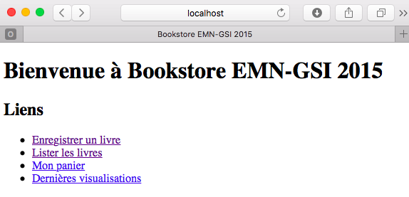
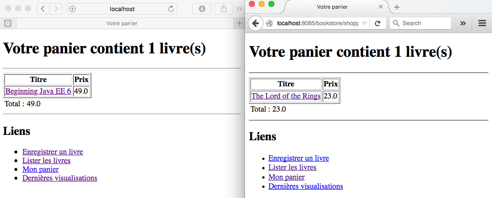
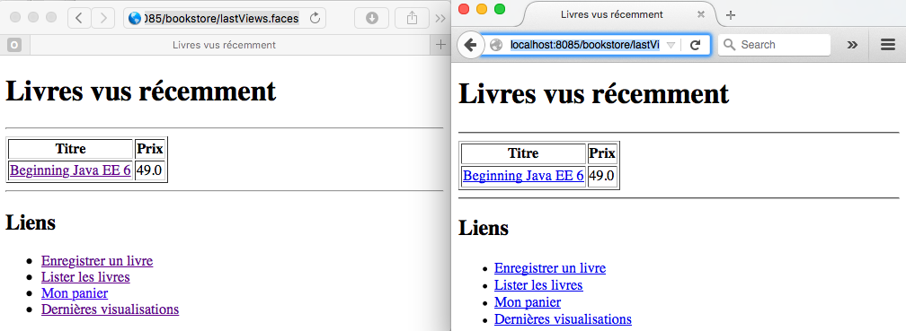

# Tutoriel 4 : Java Server Faces

Le but de ce tutoriel est de montrer comment le *framework* Java Server Faces (JSF) 
peut être utiliser pour concevoir une couche de présentation dans le cadre d'une application
Java EE. 

## Pages statique vs. dynamique

La différence majore entre une page statique et une page dynamique est que la
des règles métier, données stockes dans la base de données etc, alors que pour la première
le contenu reste statique.   

Les contenus (pages) web (pages, images, fichiers, etc.) sont placés dans le
répertoire `webapp` d'un serveur JEE. 

### Contenu statique

1. Créez une page `welcome.xhtml` dans le répertoire `src/main/webapp`
2. Ajoutez un titre et un 
3. Créez une liste de liens : 
   * Enregistrer un livre (liens vers `newBook.faces`)
   * Lister les livres (liens vers `listBooks.faces`)
   * Mon panier (liens vers `shoppingCart.faces`)
   * Livres vues récemment (liens vers `listViews.faces`)  

  ```xhtml
<?xml version="1.0" encoding="UTF-8"?>
<!DOCTYPE html
        PUBLIC "-//W3C//DTD XHTML 1.0 Transitional//EN"
        "http://www.w3.org/TR/xhtml1/DTD/xhtml1-transitional.dtd">
<html xmlns="http://www.w3.org/1999/xhtml" xml:lang="fr" lang="fr">
<head>
  <title>Bookstore EMN-GSI 2015</title>
</head>
<body>
  <h1>Bienvenue à Bookstore EMN-GSI 2015</h1>

  <h2>Liens</h2>
  <a href="newBook.faces">Enregistrer un livre</a><br/>
  <a href="listBook.faces">Lister les livres</a><br/>
  <a href="shoppingCart.faces">Mon panier</a><br/>
  <a href="listViews.faces">Dernières visualisations</a>
</body>
</html>
  ```
5. Lancez le serveur avec Maven 
6. Une fois le serveur lancé, ouvrez votre navigateur et tapez l'adresse : `http://localhost:8085/bookstore/welcome.xhtml`. 




** OBS : ** les extensions requêtes à des fichiers \*.faces sont traitées par le 
*framework* de pages dynamique JSF.


## Contenu dynamique avec JSF

En JSF, les contenus dynamique sont possible grâce à une combinaison des *Backing
Beans*/*Managed Beans* et *Views* (pages), c-a-d des *beans* qui sont "accessibles" depuis les
pages web. 

### *Backing/Managed Beans*

1. Créez le package `fr.emn.gsi2015.bookstore.presentation`.
2. Créez la classe `BookController` dans ce package.
3. Utilisez l'annotation `@Named` pour que le *bean* soit visible depuis les pages/*views*. 
4. Utilisez l'annotation `@RequestScoped` pour indiquer que ce *bean* est valide dans la portée d'une requête. Nous pouvons faire une analogie avec les *Stateless Session Beans*. 
  ```java
@Named
@SessionScoped
public class BookController {
   ...
}
  ```
5. Définissez deux variables d'instance : une du type `BookLocalService` et l'autre 
du type `ShoppingCartService`, permettant l'accès local aux *beans* de la couche métier lié au panier et aux livres. 
Pour faciliter la gestion de dépendances, vous pouvez reposer sur l'injection de dépendances en utilisant l'annotation `@Inject`. 
  ```java
@Inject
private BookLocalService bookEJB;        
  ```
6. Définissez une autre variable d'instance du type `Book` pour faciliter le passage de paramètres depuis/vers les pages. Implémentez 
les méthodes *getters* et *setters* pour cette variable.
 
7. Définissez une méthode `String doCreateBook()` décrivant une action de création en renvoyant le client vers la page `listBooks.xhtml`.
```java
public String doCreateBook() {
   book = bookEJB.createBook(book);
   return "listBooks.xhtml";
}
```
8. Définissez les méthodes `void doFindBookById()` et `List<Book> doFindBooks()`
 
Votre classe devrait ressembler à celle-ci :
  
```java
package fr.emn.gsi2015.bookstore.presentation;

import java.util.List;
import javax.enterprise.context.RequestScoped;
import javax.inject.Inject;
import javax.inject.Named;
import fr.emn.gsi2015.bookstore.business.BookLocalService;
import fr.emn.gsi2015.bookstore.persistence.Book;

@Named
@RequestScoped
public class BookController {

        @Inject
        private BookLocalService bookEJB;
        private Book book = new Book();

        public String doCreateBook() {
                book = bookEJB.createBook(book);
                return "listBooks.xhtml";
        }

        public void doFindBookById() {
                book = bookEJB.findBookById(book.getId());
        }

        public List<Book> doFindBooks() {
                return bookEJB.findBooks();
        }

        public Book getBook() {
                return book;
        }

        public void setBook(Book book) {
                this.book = book;
        }
}
```

### Pages

Maintenant nous pouvons accéder le *bean* qui nous venons de définir depuis une page avec des 
commandes entre `#{` et `}`.

1. Créez la page `listBooks.xhtml` dans `src/main/webapp`.
2. Ajoutez le titre `Liste de livres` à la page (à apparaître sur la fenêtre du navigateur).  
3. Ajoutez le même tire dans le corps de la page.  
4. Utilisez le composant `dataTable` pour afficher la liste de livres en
   faisant référence au *managed bean* `#{bookController.doFindBooks()}`. Seul le titre et le
prix doivent être affichés. 
<!-- En cliquant sur le titre le client doit être mené à
la page `viewBook.xhtml`. Ceci montre les détails du livre en question.-->   
5. Enfin, ajoutez le même menu que vous avez implémenté dans `menu.xhtml` au bas de page de `listBooks.xhtml`.

  ```xhtml
<!DOCTYPE html PUBLIC "-//W3C//DTD XHTML 1.0 Transitional//EN"
        "http://www.w3.org/TR/xhtml1/DTD/xhtml1-transitional.dtd">
<html xmlns="http://www.w3.org/1999/xhtml"
        xmlns:h="http://xmlns.jcp.org/jsf/html"
        xmlns:f="http://java.sun.com/jsf/core">
<h:head>
        <title>Liste de livres</title>
</h:head>
<h:body>
        <h1>Liste de livres</h1>
        <hr />
        <h:dataTable value="#{bookController.doFindBooks()}" var="book"
                border="1">
                <h:column>
                        <f:facet name="header">
                                <h:outputText value="Title" />
                        </f:facet>
                        <h:outputText value="#{book.title}" />
                </h:column>
                <h:column>
                        <f:facet name="header">
                                <h:outputText value="Price" />
                        </f:facet>
                        <h:outputText value="#{book.price}" />
                </h:column>

        </h:dataTable>
        <hr />
        <h2>Liens</h2>
<ul>
<li><a href="newBook.faces">Enregistrer un livre</a></li>
<li><a href="listBooks.faces">Lister les livres</a></li>
<li><a href="shoppingCart.faces">Mon panier</a><br/></li>
<li><a href="listViews.faces">Dernières visualisations</a></li>
</ul>
</h:body>
</html>
  ```

Lancez la serveur avec Maven et consultez la page `listBooks` depuis la page `menu.xhtml`.  


### Formulaires et soumission de données

Nous pouvons également implémenter une page permettant l'enregistrement d'un nouveau livre. 

1. Créez la page `newBook.xhtml` dans `src/main/webapp`.
2. Ajoutez le titre `Enregistrer un livre` à la page et au corps de la page.  
3. Ajoutez un formulaire (avec la balise `form`) permettant le remplissage des informations du livre. Vous pouvez utiliser. Utilisez 
la balise `panelGrid` avec deux colonnes : une pour le nom de l'attribut et l'autre pour le champs à remplir. Les champs peuvent
être liés directement à un attribut de l'objet `book` du *managed bean* `BookController` par l'attribut `value` de la balise de chaque 
champs du formulaire, comme indiqué ci-dessous. 
  
  ```xhtml
<h:panelGrid columns="2">
     <h:outputLabel value="ISBN : " />
     <h:inputText value="#{bookController.book.isbn}" />

     <h:outputLabel value="Titre :" />
     <h:inputText value="#{bookController.book.title}" />

     <h:outputLabel value="Prix : " />
     <h:inputText value="#{bookController.book.price}" />
  
     <h:outputLabel value="Description  : " />
     <h:inputTextarea value="#{bookController.book.description}" cols="20"
          rows="5" />
  
     <h:outputLabel value="Nombre de pages : " />
     <h:inputText value="#{bookController.book.nbOfPage}" />
  
     <h:outputLabel value="Illustrations : " />
     <h:selectBooleanCheckbox value="#{bookController.book.illustrations}" />
</h:panelGrid>
  ```

4. Ajoutez un bouton permettant soumettre le formulaire en appelant la méthode `doCreateBook` du *managed bean*.
  
  ```xhtml 
<h:commandButton value="Create a book" action="#{bookController.doCreateBook}" />
  ```
5. Ainsi comme pour `listBooks.xhtml`, ajouter un menu en bas de la page. 
 
Votre page devrait ressembler au code ci-dessous : 

```xhtml
<!DOCTYPE html PUBLIC "-//W3C//DTD XHTML 1.0 Transitional//EN"
        "http://www.w3.org/TR/xhtml1/DTD/xhtml1-transitional.dtd">
<html xmlns="http://www.w3.org/1999/xhtml"
        xmlns:h="http://xmlns.jcp.org/jsf/html">
   <h:head>
        <title>Enregistrer un livre</title>
   </h:head>
   <h:body>
     <h1>Enregistrer un livre</h1>
     <hr />
     <h:form>
           <h:panelGrid columns="2">
           <h:outputLabel value="ISBN : " />
           <h:inputText value="#{bookController.book.isbn}" />

           <h:outputLabel value="Titre :" />
           <h:inputText value="#{bookController.book.title}" />

           <h:outputLabel value="Prix : " />
           <h:inputText value="#{bookController.book.price}" />

           <h:outputLabel value="Description  : " />
           <h:inputTextarea value="#{bookController.book.description}" cols="20"
                   rows="5" />

           <h:outputLabel value="Nombre de pages : " />
           <h:inputText value="#{bookController.book.nbOfPage}" />

           <h:outputLabel value="Illustrations : " />
           <h:selectBooleanCheckbox value="#{bookController.book.illustrations}" />

           </h:panelGrid>
           <h:commandButton value="Enregistrer"
                   action="#{bookController.doCreateBook}" />
                   
     </h:form>
     <hr />
     <h2>Liens</h2>
      <ul>
        <li><a href="newBook.faces">Enregistrer un livre</a></li>
        <li><a href="listBooks.faces">Lister les livres</a></li>
        <li><a href="shoppingCart.faces">Mon panier</a><br/></li>
        <li><a href="listViews.faces">Dernières visualisations</a></li>
     </ul>
   </h:body>
</html>
```
Lancez la serveur avec Maven et consultez la page `Enregistrer un livre` depuis la page `menu.xhtml`. Testez l'enregistrement de livres en entrant les valeurs d'un livre quelconque.  

  


### Navigation

Les exemples ci-dessus utilise deux moyens de navigation entre pages : 
  * Un hyperlien explicite en html avec `<a href...` 
  * Quand on est redirigé lors d'une action (ex. : le `return "listBooks.html` dans `BookController`)  

Aucun de ces exemples montrent comment on peut naviguer d'un page à l'autre en
apportant des paramètres utiles à chaque page. 

#### Passer des paramètres

Nous pouvons passer un paramètre en ajoutant
`?nomDuParametre=valeurDuParametre` à l'adresse de la requête. Nous pouvons donc modifier la page 
`listBooks.xhtml` ainsi :  

A la place de 
```xhtml
<h:outputText value="#{book.title}" />
```
Mettre 

```xhtml
<h:link outcome="viewBook.xhtml" value="#{book.title}" >
       <f:param name="idBook" value="#{book.id}" />
</h:link>
```
ou

```xhtml
<h:link outcome="viewBook.xhtml?idBook=#{book.id}" value="#{book.title}"/>
```

#### Obtenir des paramètres envoyés depuis une autre page

Nous allons maintenant créer la page `viewBook.xhtml`, qui va exhiber les
détails d'un livre dont l'identifiant (`idBook`) est transmis depuis la page
`listBook.xhtml`.  

1. Créez la page `viewBook.xhtml` dans `src/main/webapp`.
2. Ajoutez le titre `Détails du livre` à la page et au corps de la page. 
3. Pour récupérez le(s) paramètres envoyés par une autre pages, vous pouvez utiliser la balise `metadata` contenant la balise `viewParam`. Une fois les paramètres sont récupérés, vous vous servez de la balise `viewAction` pour exécuter une action. Dans ce cas, nous voulons récupérer les détails d'un livre par son `id`.

  ```xhtml
<f:metadata>
     <f:viewParam name="idBook" value="#{bookController.book.id}" />
     <f:viewAction action="#{bookController.doFindBookById}" />
</f:metadata>
  ``` 
3. Comme pour la page `newBook.xhtml`, vous pouvez utiliser la balise `panelGrid` avec deux colonnes : une pour le nom de l'attribut et l'autre pour sa valeur. Ceci peut être récupérée directement en accédant à  `BookController`.
4. Ajoutez un lien (bouton) permettant ajouter le livre dans le panier. L'ajout 
sera effectivement traité dans la page `shoppingCart.xhtml`
 
  ```xhtml
<h:link outcome="shoppingCart.xhtml" value="Ajouter au panier">
     <f:param name="idBook" value="#{bookController.book.id}" />
</h:link>
  ```
5. Comme pour les autres pages, ajouter une liste de liens en bas de la page.

```xhtml
<!DOCTYPE html PUBLIC "-//W3C//DTD XHTML 1.0 Transitional//EN"
        "http://www.w3.org/TR/xhtml1/DTD/xhtml1-transitional.dtd">
<html xmlns="http://www.w3.org/1999/xhtml"
        xmlns:h="http://xmlns.jcp.org/jsf/html"
        xmlns:f="http://java.sun.com/jsf/core">

<h:head>
        <title>Détails du livre</title>
</h:head>
<h:body>
   <h1>Détails du livre</h1>
   <hr />
   <f:metadata>
      <f:viewParam name="idBook" value="#{bookController.book.id}" />
      <f:viewAction action="#{bookController.doFindBookById}" />
   </f:metadata>
   <h:panelGrid columns="2">
      <h:outputLabel value="ISBN : " />
      <h:outputText value="#{bookController.book.isbn}" />
      <h:outputLabel value="Titre : " />
      <h:outputText value="#{bookController.book.title}" />

      <h:outputLabel value="Prix : " />
      <h:outputText value="#{bookController.book.price}" />

      <h:outputLabel value="Description : " />
      <h:outputText value="#{bookController.book.description}" cols="16"
              rows="3" />

      <h:outputLabel value="Nombre de pages : " />
      <h:outputText value="#{bookController.book.nbOfPage}" />

      <h:outputLabel value="Illustrations : " />
      <h:outputLabel value="#{(bookController.book.illustrations) ? 'oui' :  'non'}" />
   </h:panelGrid>
   <h:link outcome="shoppingCart.xhtml" value="Ajouter au panier">
           <f:param name="idBook" value="#{bookController.book.id}" />
   </h:link>
   <hr />
    <h2>Liens</h2>
    <ul>
        <li><a href="newBook.faces">Enregistrer un livre</a></li>
        <li><a href="listBooks.faces">Lister les livres</a></li>
        <li><a href="shoppingCart.faces">Mon panier</a><br /></li>
        <li><a href="listViews.faces">Dernières visualisations</a></li>
    </ul>
</h:body>
</html>
```

Lancez le serveur et naviguez de la page des liens à la liste de livres, puis
la page des détails d'un livre.  

  


### Panier


#### *Managed Bean* 

Nous pouvons procéder de façon similaire pour mettre en œuvre le panier du magasin. Nous avons donc besoin 
d'implémenter un *Managed Bean* pour interagir avec le(s) page(s) web.

1. Créez la classe `BookController` dans le package `fr.emn.gsi2015.bookstore.presentation`.
2. Utilisez l'annotation `@Named` pour que le *bean* soit visible depuis les pages. 
3. Utilisez l'annotation `@SessionScoped` pour indiquer que ce *bean* est valide dans la portée d'une session. 
Ainsi comme pour les *Managed Beans* annotés avec `@RequestScoped` et les *Stateful Session Beans*, nous pouvons 
faire une analogie avec les l'annotation `@SessionScoped` et les *Stateful Session Beans*.
4. Afin de permettre la passivation, les `@SessionScoped` *Managed Beans* doivent aussi implémenter l'interface `Serializable`.
 
  ```java
@Named
@SessionScoped
public class ShoopingCartController implements Serializable {
}
  ```
5. Définissez deux variables d'instance : une du type `BookLocalService` et l'autre du type `ShoppingCartService` permettant l'accès 
aux services de la couche métier liés au panier et aux livres. 
Encore une fois, vous pouvez utiliser de l'injection pour faciliter la gestion de dépendances.Pour faciliter la gestion des dépendances.
  
  ```java
@Inject
private BookLocalService bookEJB;       
@Inject 
private ShoppingCartService shoppingCartEJB;        
  ```
6. Comme pour la classe `BookController`, définissez une autre variable d'instance du type `Book` et les *getters*  et *setters* associées. 
7. Rendez accessible aussi (par les méthodes *getters* et *setters*) la
   variable d'instance tu type `ShoppingCartService` pour que l'on puisse
l'utiliser depuis les pages.
8. Définissez une méthode `void doAddToShoppingCart()` décrivant une action
   d'ajout d'un livre au panier. 

  ```java
public void doAddToShoppingCart() {
    book = bookEJB.findBookById(book.getId());
    shoppingCartEJB.addItem(book);
}
  ```
Votre classe devrait ressembler à celle-ci :
 
```java
package fr.emn.gsi2015.bookstore.presentation;

import java.io.Serializable;

import javax.enterprise.context.SessionScoped;
import javax.inject.Inject;
import javax.inject.Named;

import fr.emn.gsi2015.bookstore.business.BookLocalService;
import fr.emn.gsi2015.bookstore.business.ShoppingCartService;
import fr.emn.gsi2015.bookstore.persistence.Book;

@Named
@SessionScoped
public class ShoppingCartController implements Serializable {

     @Inject
     private ShoppingCartService shoppingCartEJB;
     @Inject
     private BookLocalService bookEJB;

     private Book book = new Book();

     public String doAddToShoppingCart() {
             book = bookEJB.findBookById(book.getId());
             shoppingCartEJB.addItem(book);
             return "";
     }

     public Book getBook() {
             return book;
     }

     public void setBook(Book book) {
             this.book = book;
     }

     public ShoppingCartService getShoppingCartEJB() {
             return shoppingCartEJB;
     }

     public void setShoppingCartEJB(ShoppingCartService shoppingCartEJB) {
             this.shoppingCartEJB = shoppingCartEJB;
     }
}

``` 
 
Nous pouvons maintenant implémenter la page affichant les livres dans le panier du client.

1. Créez la page `shoppingCart.xhtml` dans `src/main/webapp`.
2. Ajoutez le titre `Mon panier` à la page et au corps de la page. 
3. Procédez de façon similaire à comme vous avez fait pour récupérez les paramètres envoyés 
depuis une autre page. Dans ce cas là nous voulons récupérer l'identifiant du livre envoyé depuis 
la page `viewBook.xhtml` inclue dans liens `Ajouter au panier`. Une fois le paramètre récupéré, 
nous voulons effectuer l'action d'ajout en faisant appel à la méthode `doAddToShoppingCart` de 
`ShoppingCartController`. 

```xhtml
  <f:metadata>
     <f:viewParam name="idBook" value="#{shoppingCartController.book.id}"/>
     <f:viewAction action="#{shoppingCartController.doAddToShoppingCart}"/>
  </f:metadata>
```
4. Ajoutez un message `Votre panier contiens X livre(s).`
5. Comme pour la page `listBooks.xhtml`, vous pouvez utiliser la balise `dataTable` avec deux colonnes : 
une pour le titre du libre et l'autre pour le prix. 
5. Affichez le prix total juste après le tableau.
6. Comme pour les autres pages, ajouter une liste de liens en bas de la page.

```xhtml
<!DOCTYPE html PUBLIC "-//W3C//DTD XHTML 1.0 Transitional//EN"
        "http://www.w3.org/TR/xhtml1/DTD/xhtml1-transitional.dtd">
<html xmlns="http://www.w3.org/1999/xhtml"
        xmlns:h="http://xmlns.jcp.org/jsf/html"
        xmlns:f="http://java.sun.com/jsf/core">
<h:head>
        <title>Votre panier</title>
</h:head>
<h:body>
    <f:metadata>
        <f:viewParam name="idBook" value="#{shoppingCartController.book.id}" />
        <f:viewAction action="#{shoppingCartController.doAddToShoppingCart}" />
    </f:metadata>
    <h1>
            Votre panier contient
            <h:outputText
                    value="#{shoppingCartController.shoppingCartEJB.getNumberOfItems()}" />
            livre(s)
    </h1>
    <hr />
    <h:dataTable
            value="#{shoppingCartController.shoppingCartEJB.getItems()}"
            var="book" border="1">
       <h:column>
           <f:facet name="header">
                   <h:outputText value="Title" />
           </f:facet>
           <h:link outcome="viewBook.xhtml" value="#{book.title}">
                   <f:param name="idBook" value="#{book.id}" />
           </h:link>
       </h:column>
       <h:column>
         <f:facet name="header">
                 <h:outputText value="Price" />
         </f:facet>
         <h:outputText value="#{book.price}" />
       </h:column>

    </h:dataTable>
    <h:panelGrid columns="2">
        <h:outputLabel value="Total : " />
        <h:outputText
                    value="#{shoppingCartController.shoppingCartEJB.getTotal()}" />
    </h:panelGrid>

    <hr />
    <h2>Liens</h2>
    <ul>
        <li><a href="newBook.faces">Enregistrer un livre</a></li>
        <li><a href="listBooks.faces">Lister les livres</a></li>
        <li><a href="shoppingCart.faces">Mon panier</a><br /></li>
        <li><a href="listViews.faces">Dernières visualisations</a></li>
    </ul>
</h:body>
</html>
```
Lancez le serveur avec Maven et testez le panier en ajoutant un livre et affichant le contenu du panier. Essayez avec deux navigateurs différents simulant deux clients et vérifiez que chaque client a son propre panier.  

  


### Livres vus recemment 

Dernièrement, nous allons implémenter une page permettant afficher les livres vues récemment par tous les clients. 

#### *Application Scoped Managed Bean*


1. Créez la classe `LastViewsController` dans le package `fr.emn.gsi2015.bookstore.presentation`.
2. Utilisez l'annotation `@Named` pour que le *bean* soit visible depuis les pages. 
3. Utilisez l'annotation `@ApplicationScoped` pour indiquer que ce *bean* est valide dans la portée de l'application session. 
Ici l'analogie est avec les *Session Beans* du type *Singleton*. Cela veut dire que les objets créés au 
sein du *Managed Beans* et le *Managed Bean* lui même sont les même pour toute l'application et pour tout le temps de vie de 
application indépendamment du client ou des requêtes.  
4. Définissez deux variables d'instance : une du type `BookLocalService` et l'autre du type `LastViewsService`.
6. Comme pour las classes `BookController` et `ShoppingCartController`, définissez une autre variable d'instance du type `Book` et les *getters*  et *setters* associées. 
7. Rendez accessible aussi la variable d'instance tu type `LastViewsService` pour que l'on puisse
l'utiliser depuis les pages.
8. Définissez une méthode `void doAddToLastViews()` décrivant une action
   d'ajout d'un livre aux à la liste de livres visualisés récemment.  

Voici comme votre classe devrait ressembler : 


```java
package fr.emn.gsi2015.bookstore.presentation;

import javax.enterprise.context.ApplicationScoped;
import javax.inject.Inject;
import javax.inject.Named;

import fr.emn.gsi2015.bookstore.business.BookLocalService;
import fr.emn.gsi2015.bookstore.business.LastViewsService;
import fr.emn.gsi2015.bookstore.persistence.Book;

@Named
@ApplicationScoped
public class LastViewsController  {
    @Inject
    private LastViewsService lastViewsEJB;
    
    @Inject
    private BookLocalService bookEJB;

    private Book book = new Book();

    public void doAddToLastViews() {
            book = bookEJB.findBookById(book.getId());
            lastViewsEJB.addLastViewed(book);
    }

    public Book getBook() {
            return book;
    }

    public void setBook(Book book) {
            this.book = book;
    }

    public LastViewsService getLastViewsEJB() {
            return lastViewsEJB;
    }

    public void setLastViewsEJB(LastViewsService lastViewsEJB) {
            this.lastViewsEJB = lastViewsEJB;
    }
}
```

#### Page

Avant d'implémenter la page `lastViews.xhtml` nous devons d'avantage modifier
la page `viewBook.xhtml` pour que l'action `doAddToLastViews` soit exécuté à
chaque fois qu'un livre est visualisé. Il faut faire pareil à l'action 
`doFindBookById` de `BookController` : récupérer le `idBook` et l'affecter à l'attribut
`book.id` de `LastViewsController`, ensuite exécuter l'action `doAddToLastViews`. 

```html
<f:metadata>
   <f:viewParam name="idBook" value="#{bookController.book.id}" />
   <f:viewAction action="#{bookController.doFindBookById}" />
   <f:viewParam name="idBook" value="#{lastViewsController.book.id}" />
   <f:viewAction action="#{lastViewsController.doAddToLastViews}" />
</f:metadata>```

L'implémentation de la page `lastViews.xhtml` suit les mêmes étapes de la page `listBooks.html`. 
La seule différence étant la valeur de l'attribut `value` de la balise `dataTable` qui devrait 
faire référence plutôt à `vlastViewsController.lastViewsEJB.getLastViewed()`. 

```xhtml
<!DOCTYPE html PUBLIC "-//W3C//DTD XHTML 1.0 Transitional//EN"
        "http://www.w3.org/TR/xhtml1/DTD/xhtml1-transitional.dtd">
<html xmlns="http://www.w3.org/1999/xhtml"
        xmlns:h="http://xmlns.jcp.org/jsf/html"
        xmlns:f="http://xmlns.jcp.org/jsf/core">
<h:head>
    <title>Livres vus récemment</title>
</h:head>
<h:body>
    <h1>Livres vus récemment</h1>
    <hr />
    <h:dataTable
            value="#{lastViewsController.lastViewsEJB.getLastViewed()}" var="book"
            border="1">
      <h:column>
              <f:facet name="header">
                      <h:outputText value="Titre" />
              </f:facet>
              <h:link outcome="viewBook.xhtml" value="#{book.title}">
                      <f:param name="idBook" value="#{book.id}" />
              </h:link>
      </h:column>
      <h:column>
              <f:facet name="header">
                      <h:outputText value="Prix" />
              </f:facet>
              <h:outputText value="#{book.price}" />
      </h:column>
    </h:dataTable>
    <hr />
    <h2>Liens</h2>
    <ul>
      <li><a href="newBook.faces">Enregistrer un livre</a></li>
      <li><a href="listBooks.faces">Lister les livres</a></li>
      <li><a href="shoppingCart.faces">Mon panier</a><br /></li>
      <li><a href="listViews.faces">Dernières visualisations</a></li>
    </ul>
</h:body>
</html>```

Lancez le serveur et testez la page des livres récemment vus en voyant les
détails des livres. Essayez avec deux navigateurs différents pour simuler deux
clients et confirmez que la page `lastViews.xhtml` affiche les mêmes livres
pour les deux clients.  

  

## Templates

Vous avez peut-être remarqué que il y beaucoup de redondance dans les codes des pages xhtml. En effet, 
les pages ont une mise en forme très similaire et nous aurions pu factoriser une partie no négligeable 
du code.   

Nous pouvons définir un *template* contenant les éléments en commun à toutes
nos pages. Comme vous pouvez remarquer dans le code ci-dessous, la balise
`ui:insert` peut sert à préciser les endroits personnalisables du code, par
exemple, les titres ainsi que le contenu (`dataTable`, `panelGrid`, etc.).  

```xhtml
<!DOCTYPE html PUBLIC "-//W3C//DTD XHTML 1.0 Transitional//EN"
        "http://www.w3.org/TR/xhtml1/DTD/xhtml1-transitional.dtd">
<html xmlns="http://www.w3.org/1999/xhtml"
        xmlns:ui="http://xmlns.jcp.org/jsf/facelets"
        xmlns:h="http://xmlns.jcp.org/jsf/html">
<h:head>
    <title><ui:insert name="title">Default title</ui:insert></title>
</h:head>
<h:body>
    <h1>
       <ui:insert name="title">Default title</ui:insert>
    </h1>
    <hr />
    <ui:insert name="content">Default content</ui:insert>
    <hr />
    <ul>
       <li><a href="newBook.faces">Enregistrer un livre</a></li>
       <li><a href="listBooks.faces">Lister les livres</a></li>
       <li><a href="shoppingCart.faces">Mon panier</a><br /></li>
       <li><a href="listViews.faces">Dernières visualisations</a></li>
    </ul>
</h:body>
</html>
```
Dans chaque page nous pouvons donc faire référence au *template* à l'aide de la 
balise `ui:composition`. Comme vous pouvez le voir, notre *template* est défini 
dans le fichier `layout.xhtml`. Il ne reste plus qu'à définir les points 
personnalisables avec la balise `ui:define`.   

```xhtml
<!DOCTYPE html PUBLIC "-//W3C//DTD XHTML 1.0 Transitional//EN"
        "http://www.w3.org/TR/xhtml1/DTD/xhtml1-transitional.dtd">
<html xmlns="http://www.w3.org/1999/xhtml"
        xmlns:h="http://xmlns.jcp.org/jsf/html"
      	xmlns:ui="http://xmlns.jcp.org/jsf/facelets"
        xmlns:f="http://java.sun.com/jsf/core">
  <ui:composition template="layout.xhtml">
     <ui:define name="title">Liste de livres</ui:define>
     <ui:define name="content">
         <h:dataTable value="#{bookController.doFindBooks()}" var="book"
                 border="1">
           <h:column>	
              <f:facet name="header">
                   <h:outputText value="Titre" />
              </f:facet>
              <h:link outcome="viewBook.xhtml" value="#{book.title}">
                   <f:param name="idBook" value="#{book.id}" />
              </h:link>
           </h:column>
           <h:column>
               <f:facet name="header">
                   <h:outputText value="Prix" />
               </f:facet>
               <h:outputText value="#{book.price}" />
           </h:column>

         </h:dataTable>
     </ui:define>
  </ui:composition>
</html>
```

Vous pouvez modifiez les autres pages en faisant référence au même *template* afin d'avoir 
un code factorisé. 


