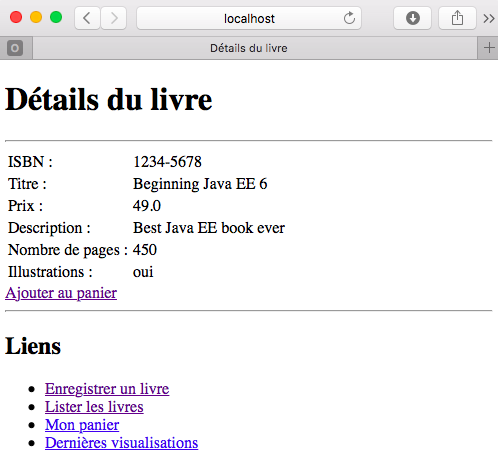

# Java Server Faces

Le but de ce tutoriel est de montrer comment le *framework* Java Server Faces (JSF) 
peut être utiliser pour concevoir une couche de présentation dans le cadre d'une application
Java EE. 

## Pages statique vs. dynamique

La différence majore entre une page statique et une page dynamique est que la
deuxième construit son contenu à chaque requête en fonction
des règles métier, données stockes dans la base de données etc, alors que pour la première
le contenu reste statique.   

Les contenus (pages) web (pages, images, fichiers, etc.) sont placés dans le
répertoire `webapp` d'un serveur JEE. 

### Contenu statique

1. Créez une page `menu.xhtml` dans le répertoire `src/main/webapp`
2. Ajoutez un titre et un 
3. Créez une liste de liens : 
   * Enregistrer un livre (liens vers `newBook.faces`)
   * Lister les livres (liens vers `listBooks.faces`)
   * Mon panier (liens vers `shoppingCart.faces`)
   * Livres vues récemment (liens vers `listViews.faces`)  

  ```xhtml
<?xml version="1.0" encoding="UTF-8"?>
<!DOCTYPE html
        PUBLIC "-//W3C//DTD XHTML 1.0 Transitional//EN"
        "http://www.w3.org/TR/xhtml1/DTD/xhtml1-transitional.dtd">
<html xmlns="http://www.w3.org/1999/xhtml" xml:lang="fr" lang="fr">
<head>
  <title>Bookstore EMN-GSI 2015</title>
</head>
<body>
  <h1>Bienvenue à Bookstore EMN-GSI 2015</h1>

  <h2>Liens</h2>
  <a href="newBook.faces">Enregistrer un livre</a><br/>
  <a href="listBook.faces">Lister les livres</a><br/>
  <a href="shoppingCart.faces">Mon panier</a><br/>
  <a href="listViews.faces">Dernières visualisations</a>
</body>
</html>
  ```
5. Lancez le serveur avec Maven 
6. Une fois le serveur lancé, ouvrez votre navigateur et tapez l'adresse : `http://localhost:8085/bookstore/menu.xhtml`. 


** OBS : ** les extensions requêtes à des fichiers \*.faces sont traitées par le 
*framework* de pages dynamique JSF.


## Contenu dynamique avec JSF

En JSF, les contenus dynamique sont possible grâce à une combinaison des *Backing
Beans*/*Managed Beans* et *Views* (pages), c-a-d des *beans* qui sont "accessibles" depuis les
pages web. 

### *Backing/Managed Beans*

1. Créez le package `fr.emn.gsi2015.bookstore.presentation`.
2. Créez la classe `BookController` dans ce package.
3. Utilisez l'annotation `@Named` pour que le *bean* soit visible depuis les pages/*views*. 
4. Utilisez l'annotation `@RequestScoped` pour indiquer que ce *bean* est valide dans la portée d'une requête. Nous pouvons faire une analogie avec les *Stateful Session Beans*. 
  ```java
@Named
@RequestScoped
public class BookController {
   ...
}
  ```
5. Définissez une variable d'instance du type `BookLocalService` permettant l'accès local l'EJB `BookEJB`. Pour faciliter cette tâche, 
vous pouvez reposer sur l'injection de dépendances en utilisant l'annotation `@Inject`.  Comme variables d'instance, défini.
  ```java
@Inject
private BookLocalService bookEJB;        
  ```
6. Définissez une autre variable d'instance du type `Book` pour faciliter le passage de paramètres depuis/vers les pages. Implémentez 
les méthodes *getters* et *setters* pour cette variable.
 
7. Définissez une méthode `void doCreateBook()` décrivant une action de création en renvoyant le client vers la page `listBooks.xhtml`.
```java
public String doCreateBook() {
   book = bookEJB.createBook(book);
   return "listBooks.xhtml";
}
```
8. Définissez les méthodes `void doFindBookById()` et `List<Book> doFindBooks()`
 
Votre classe devrait ressembler à celle-ci :
  
```java
package fr.emn.gsi2015.bookstore.presentation;

import java.util.List;
import javax.enterprise.context.RequestScoped;
import javax.inject.Inject;
import javax.inject.Named;
import fr.emn.gsi2015.bookstore.business.BookLocalService;
import fr.emn.gsi2015.bookstore.persistence.Book;

@Named
@RequestScoped
public class BookController {

        @Inject
        private BookLocalService bookEJB;
        private Book book = new Book();

        public String doCreateBook() {
                book = bookEJB.createBook(book);
                return "listBooks.xhtml";
        }

        public void doFindBookById() {
                book = bookEJB.findBookById(book.getId());
        }

        public List<Book> doFindBooks() {
                return bookEJB.findBooks();
        }

        public Book getBook() {
                return book;
        }

        public void setBook(Book book) {
                this.book = book;
        }
}
```

### Pages

Maintenant nous pouvons accéder le *bean* qui nous venons de définir depuis une page avec des 
commandes entre `#{` et `}`.

1. Créez la page `listBooks.xhtml` dans `src/main/webapp`.
2. Ajoutez le titre `Liste de livres` à la page (à apparaître sur la fenêtre du navigateur).  
3. Ajoutez le même tire dans le corps de la page.  
4. Utilisez le composant `dataTable` pour afficher la liste de livres en
   faisant référence au *managed bean* `#{bookController.doFindBooks()}`. Seul le titre et le
prix doivent être affichés. 
<!-- En cliquant sur le titre le client doit être mené à
la page `viewBook.xhtml`. Ceci montre les détails du livre en question.-->   
5. Enfin, ajoutez le même menu que vous avez implémenté dans `menu.xhtml` au bas de page de `listBooks.xhtml`.

  ```xhtml
<!DOCTYPE html PUBLIC "-//W3C//DTD XHTML 1.0 Transitional//EN"
        "http://www.w3.org/TR/xhtml1/DTD/xhtml1-transitional.dtd">
<html xmlns="http://www.w3.org/1999/xhtml"
        xmlns:h="http://xmlns.jcp.org/jsf/html"
        xmlns:ui="http://xmlns.jcp.org/jsf/facelets"
        xmlns:f="http://java.sun.com/jsf/core">
<h:head>
        <title>Liste de livres</title>
</h:head>
<h:body>
        <h1>Liste de livres</h1>
        <hr />
        <h:dataTable value="#{bookController.doFindBooks()}" var="book"
                border="1">
                <h:column>
                        <f:facet name="header">
                                <h:outputText value="Title" />
                        </f:facet>
                        <h:outputText value="#{book.title}" />
                </h:column>
                <h:column>
                        <f:facet name="header">
                                <h:outputText value="Price" />
                        </f:facet>
                        <h:outputText value="#{book.price}" />
                </h:column>

        </h:dataTable>
        <hr />
        <h2>Liens</h2>
<ul>
<li><a href="newBook.faces">Enregistrer un livre</a></li>
<li><a href="listBooks.faces">Lister les livres</a></li>
<li><a href="shoppingCart.faces">Mon panier</a><br/></li>
<li><a href="listViews.faces">Dernières visualisations</a></li>
</ul>
</h:body>
</html>
  ```

Lancez la serveur avec Maven et consultez la page `listBooks` depuis la page `menu.xhtml`.  


### Formulaires et soumission de données

Nous pouvons également implémenter une page permettant l'enregistrement d'un nouveau livre. 

1. Créez la page `newBook.xhtml` dans `src/main/webapp`.
2. Ajoutez le titre `Enregistrer un livre` à la page et au corps de la page.  
3. Ajoutez un formulaire (avec la balise `form`) permettant le remplissage des informations du livre. Vous pouvez utiliser. Utilisez 
la balise `panelGrid` avec deux colonnes : une pour le nom de l'attribut et l'autre pour le champs à remplir. Les champs peuvent
être liés directement à un attribut de l'objet `book` du *managed bean* `BookController` par l'attribut `value` de la balise de chaque 
champs du formulaire, comme indiqué ci-dessous. 
  
  ```xhtml
<h:panelGrid columns="2">
     <h:outputLabel value="ISBN : " />
     <h:inputText value="#{bookController.book.isbn}" />

     <h:outputLabel value="Titre :" />
     <h:inputText value="#{bookController.book.title}" />

     <h:outputLabel value="Prix : " />
     <h:inputText value="#{bookController.book.price}" />
  
     <h:outputLabel value="Description  : " />
     <h:inputTextarea value="#{bookController.book.description}" cols="20"
          rows="5" />
  
     <h:outputLabel value="Nombre de pages : " />
     <h:inputText value="#{bookController.book.nbOfPage}" />
  
     <h:outputLabel value="Illustrations : " />
     <h:selectBooleanCheckbox value="#{bookController.book.illustrations}" />
</h:panelGrid>
  ```

4. Ajoutez un bouton permettant soumettre le formulaire en appelant la méthode `doCreateBook` du *managed bean*.
  
  ```xhtml 
<h:commandButton value="Create a book" action="#{bookController.doCreateBook}" />
  ```
5. Ainsi comme pour `listBooks.xhtml`, ajouter un menu en bas de la page. 
 
Votre page devrait ressembler au code ci-dessous : 

```xhtml
<!DOCTYPE html PUBLIC "-//W3C//DTD XHTML 1.0 Transitional//EN"
        "http://www.w3.org/TR/xhtml1/DTD/xhtml1-transitional.dtd">
<html xmlns="http://www.w3.org/1999/xhtml"
        xmlns:h="http://xmlns.jcp.org/jsf/html"
        xmlns:ui="http://xmlns.jcp.org/jsf/facelets">
   <h:head>
        <title>Enregistrer un livre</title>
   </h:head>
   <h:body>
     <h1>Enregistrer un livre</h1>
     <hr />
     <h:form>
           <h:panelGrid columns="2">
           <h:outputLabel value="ISBN : " />
           <h:inputText value="#{bookController.book.isbn}" />

           <h:outputLabel value="Titre :" />
           <h:inputText value="#{bookController.book.title}" />

           <h:outputLabel value="Prix : " />
           <h:inputText value="#{bookController.book.price}" />

           <h:outputLabel value="Description  : " />
           <h:inputTextarea value="#{bookController.book.description}" cols="20"
                   rows="5" />

           <h:outputLabel value="Nombre de pages : " />
           <h:inputText value="#{bookController.book.nbOfPage}" />

           <h:outputLabel value="Illustrations : " />
           <h:selectBooleanCheckbox value="#{bookController.book.illustrations}" />

           </h:panelGrid>
           <h:commandButton value="Enregistrer"
                   action="#{bookController.doCreateBook}" />
                   
     </h:form>
     <hr />
     <h2>Liens</h2>
      <ul>
        <li><a href="newBook.faces">Enregistrer un livre</a></li>
        <li><a href="listBooks.faces">Lister les livres</a></li>
        <li><a href="shoppingCart.faces">Mon panier</a><br/></li>
        <li><a href="listViews.faces">Dernières visualisations</a></li>
     </ul>
   </h:body>
</html>
```
Lancez la serveur avec Maven et consultez la page `Enregistrer un livre` depuis la page `menu.xhtml`. Testez l'enregistrement de livres en entrant les valeurs d'un livre quelconque.  

  


### Navigation

Les exemples ci-dessus utilise deux moyens de navigation entre pages : 
  * Un hyperlien explicite en html avec `<a href...` 
  * Quand on est redirigé lors d'une action (ex. : le `return "listBooks.html` dans `BookController`)  

Aucun de ces exemples montrent comment on peut naviguer d'un page à l'autre en
apportant des paramètres utiles à chaque page. 

#### Passer des paramètres

Nous pouvons passer un paramètre en ajoutant
`?nomDuParametre=valeurDuParametre` à l'adresse de la requête. Nous pouvons donc modifier la page 
`listBooks.xhtml` ainsi :  

A la place de 
```xhtml
<h:outputText value="#{book.title}" />
```
Mettre 

```xhtml
<h:link outcome="viewBook.xhtml" value="#{book.title}" >
       <f:param name="idBook" value="#{book.id}" />
</h:link>
```
ou

```xhtml
<h:link outcome="viewBook.xhtml?idBook=#{book.id}" value="#{book.title}"/>
```

#### Obtenir des paramètres envoyés depuis une autre page

Nous allons maintenant créer la page `viewBook.xhtml`, qui va exhiber les
détails d'un livre dont l'identifiant (`idBook`) est transmis depuis la page
`listBook.xhtml`.  

1. Créez la page `viewBook.xhtml` dans `src/main/webapp`.
2. Ajoutez le titre `Détails du livre` à la page et au corps de la page. 
3. Pour récupérez le(s) paramètres envoyés par une autre pages, vous pouvez utiliser la balise `metadata` contenant la balise `viewParam`. Une fois les paramètres sont récupérés, vous vous servez de la balise `viewAction` pour exécuter une action. Dans ce cas, nous voulons récupérer les détails d'un livre par son `id`.

  ```xhtml
<f:metadata>
     <f:viewParam name="idBook" value="#{bookController.book.id}" />
     <f:viewAction action="#{bookController.doFindBookById}" />
</f:metadata>
  ``` 
3. Comme pour la page `newBook.xhtml`, vous pouvez utiliser la balise `panelGrid` avec deux colonnes : une pour le nom de l'attribut et l'autre pour sa valeur. Ceci peut être récupérée directement en accédant à  `BookController`.
4. Ajoutez un lien (bouton) permettant ajouter le livre dans le panier. L'ajout 
sera effectivement traité dans la page `shoppingCart.xhtml`
```xhtml
<h:link outcome="shoppingCart.xhtml" value="Ajouter au panier">
     <f:param name="idBook" value="#{bookController.book.id}" />
</h:link>
```
5. Comme pour les autres pages, ajouter une liste de liens en bas de la page.

```xhtml
<!DOCTYPE html PUBLIC "-//W3C//DTD XHTML 1.0 Transitional//EN"
        "http://www.w3.org/TR/xhtml1/DTD/xhtml1-transitional.dtd">
<html xmlns="http://www.w3.org/1999/xhtml"
        xmlns:h="http://xmlns.jcp.org/jsf/html"
        xmlns:ui="http://xmlns.jcp.org/jsf/facelets"
        xmlns:f="http://java.sun.com/jsf/core">

<h:head>
        <title>Détails du livre</title>
</h:head>
<h:body>
   <h1>Détails du livre</h1>
   <hr />
   <f:metadata>
      <f:viewParam name="idBook" value="#{bookController.book.id}" />
      <f:viewAction action="#{bookController.doFindBookById}" />
   </f:metadata>
   <h:panelGrid columns="2">
      <h:outputLabel value="ISBN : " />
      <h:outputText value="#{bookController.book.isbn}" />
      <h:outputLabel value="Titre : " />
      <h:outputText value="#{bookController.book.title}" />

      <h:outputLabel value="Prix : " />
      <h:outputText value="#{bookController.book.price}" />

      <h:outputLabel value="Description : " />
      <h:outputText value="#{bookController.book.description}" cols="16"
              rows="3" />

      <h:outputLabel value="Nombre de pages : " />
      <h:outputText value="#{bookController.book.nbOfPage}" />

      <h:outputLabel value="Illustrations : " />
      <h:outputLabel
              value="#{(bookController.book.illustrations) ? 'oui' :  'non'}" />
   </h:panelGrid>
   <h:link outcome="shoppingCart.xhtml" value="Ajouter au panier">
           <f:param name="idBook" value="#{bookController.book.id}" />
   </h:link>
</h:body>
</html>
```

Lancez le serveur et naviguez de la page des liens à la liste de livres, puis
la page des détails d'un livre.  

  


### Panier *RequestScoped*


### *SessionScoped*


### *ApplicationScoped*


### *Templates*
